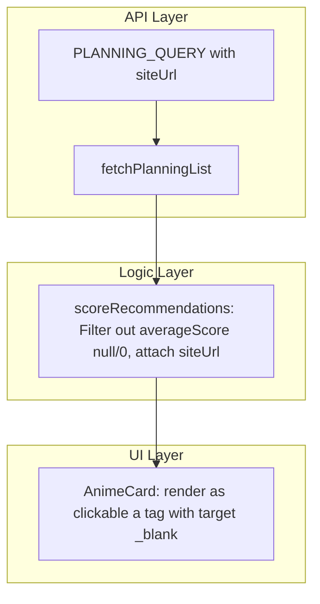

# Unreleased Anime Filter & Clickable AniList Cards Implementation Plan

> **For agentic workers:** REQUIRED SUB-SKILL: Use superpowers:subagent-driven-development to implement this plan task-by-task. Steps use checkbox (`- [ ]`) syntax for tracking.

**Goal:** Filter out unreleased anime (`averageScore` null or 0) from recommendations and make `AnimeCard` clickable to open the anime page on AniList in a new tab.

**Architecture:** Update `PLANNING_QUERY` in `src/api/anilist.js` to fetch `siteUrl`, filter out unreleased anime in `src/logic/recommender.js`, and render `AnimeCard` as an `<a>` link in `src/components/AnimeCard.jsx`.

**Architecture Diagram:**



**Tech Stack:** React 19, Vanilla CSS, Vitest

## Global Constraints

- Exclude unreleased anime (`averageScore` is null or 0)
- `AnimeCard` rendered as `<a href={siteUrl} target="_blank" rel="noopener noreferrer" className="anime-card">`
- Full test coverage for API, logic, and UI

---

### Task 1: Add `siteUrl` to AniList API `PLANNING_QUERY`

**Files:**
- Modify: [src/api/anilist.js](file:///C:/Sistemas/Projetos/animes/src/api/anilist.js)
- Modify: [src/api/anilist.test.js](file:///C:/Sistemas/Projetos/animes/src/api/anilist.test.js)

- [ ] **Step 1: Write failing test in `anilist.test.js` checking `siteUrl`**

Add `siteUrl` expectation to `fetchPlanningList` test in [src/api/anilist.test.js](file:///C:/Sistemas/Projetos/animes/src/api/anilist.test.js):

```js
expect(result[0].media.siteUrl).toBe('https://anilist.co/anime/10')
```

- [ ] **Step 2: Run test to verify failure**

```bash
npx vitest run src/api/anilist.test.js
```

Expected: FAIL — `siteUrl` is undefined in test mock.

- [ ] **Step 3: Update `PLANNING_QUERY` in `anilist.js` and mock in `anilist.test.js`**

In [src/api/anilist.js](file:///C:/Sistemas/Projetos/animes/src/api/anilist.js):
Add `siteUrl` to `PLANNING_QUERY`:

```graphql
query ($userName: String) {
  MediaListCollection(userName: $userName, type: ANIME, status: PLANNING) {
    lists {
      entries {
        media {
          id
          title { romaji english }
          genres
          coverImage { large }
          averageScore
          popularity
          siteUrl
        }
      }
    }
  }
}
```

In [src/api/anilist.test.js](file:///C:/Sistemas/Projetos/animes/src/api/anilist.test.js):
Include `siteUrl: 'https://anilist.co/anime/10'` in the test mock response.

- [ ] **Step 4: Run test to verify it passes**

```bash
npx vitest run src/api/anilist.test.js
```

- [ ] **Step 5: Commit**

```bash
git add src/api/
git commit -m "feat: fetch siteUrl in AniList PLANNING_QUERY"
```

---

### Task 2: Filter unreleased anime & attach `siteUrl` in `recommender.js`

**Files:**
- Modify: [src/logic/recommender.js](file:///C:/Sistemas/Projetos/animes/src/logic/recommender.js)
- Modify: [src/logic/recommender.test.js](file:///C:/Sistemas/Projetos/animes/src/logic/recommender.test.js)

- [ ] **Step 1: Write failing test in `recommender.test.js`**

In [src/logic/recommender.test.js](file:///C:/Sistemas/Projetos/animes/src/logic/recommender.test.js), add a test case:

```js
  it('filters out unreleased anime where averageScore is null or 0', () => {
    const planning = [
      {
        media: {
          id: 1, title: { romaji: 'Released', english: 'Released' },
          genres: ['Action'], coverImage: { large: '' }, averageScore: 70, siteUrl: 'https://anilist.co/anime/1',
        },
      },
      {
        media: {
          id: 2, title: { romaji: 'Unreleased Null', english: 'Unreleased Null' },
          genres: ['Action'], coverImage: { large: '' }, averageScore: null, siteUrl: 'https://anilist.co/anime/2',
        },
      },
      {
        media: {
          id: 3, title: { romaji: 'Unreleased Zero', english: 'Unreleased Zero' },
          genres: ['Action'], coverImage: { large: '' }, averageScore: 0, siteUrl: 'https://anilist.co/anime/3',
        },
      },
    ]

    const result = scoreRecommendations(planning, tasteProfile)

    expect(result).toHaveLength(1)
    expect(result[0].id).toBe(1)
    expect(result[0].siteUrl).toBe('https://anilist.co/anime/1')
  })
```

- [ ] **Step 2: Run test to verify failure**

```bash
npx vitest run src/logic/recommender.test.js
```

Expected: FAIL — unreleased items are not filtered out.

- [ ] **Step 3: Update `scoreRecommendations` in `recommender.js`**

In [src/logic/recommender.js](file:///C:/Sistemas/Projetos/animes/src/logic/recommender.js):

```js
export function scoreRecommendations(planningEntries = [], tasteProfile = new Map()) {
  const validPlanning = planningEntries.filter((entry) => {
    const score = entry?.media?.averageScore
    return score != null && score > 0
  })

  const scored = validPlanning.map((entry) => {
    const media = entry?.media ?? {}
    const genres = media?.genres ?? []
    const matchingGenres = genres.filter((g) => tasteProfile.has(g))

    let predictedScore
    if (matchingGenres.length > 0) {
      const sum = matchingGenres.reduce(
        (acc, g) => acc + (tasteProfile.get(g).adjustedAverage ?? tasteProfile.get(g).average),
        0
      )
      predictedScore = Math.round((sum / matchingGenres.length) * 10) / 10
    } else {
      predictedScore = Math.round((media.averageScore / 10) * 10) / 10
    }

    const communityScore = Math.round((media.averageScore / 10) * 10) / 10

    return {
      id: media.id,
      title: media.title?.english || media.title?.romaji || 'Untitled',
      coverImage: media.coverImage?.large ?? '',
      genres,
      predictedScore,
      communityScore,
      siteUrl: media.siteUrl || `https://anilist.co/anime/${media.id}`,
    }
  })

  scored.sort((a, b) => {
    if (b.predictedScore !== a.predictedScore) {
      return b.predictedScore - a.predictedScore
    }
    return b.communityScore - a.communityScore
  })

  return scored
}
```

- [ ] **Step 4: Run tests to verify they pass**

```bash
npx vitest run src/logic/recommender.test.js
```

Expected: PASS

- [ ] **Step 5: Commit**

```bash
git add src/logic/
git commit -m "feat: filter out unreleased anime and attach siteUrl in scoreRecommendations"
```

---

### Task 3: Render `AnimeCard` as clickable `<a>` link

**Files:**
- Modify: [src/components/AnimeCard.jsx](file:///C:/Sistemas/Projetos/animes/src/components/AnimeCard.jsx)
- Modify: [src/components/AnimeCard.css](file:///C:/Sistemas/Projetos/animes/src/components/AnimeCard.css)
- Modify: [src/components/Dashboard.test.jsx](file:///C:/Sistemas/Projetos/animes/src/components/Dashboard.test.jsx)

- [ ] **Step 1: Update `AnimeCard.jsx` to render an `<a>` element**

Modify [src/components/AnimeCard.jsx](file:///C:/Sistemas/Projetos/animes/src/components/AnimeCard.jsx):

```jsx
import './AnimeCard.css'

export default function AnimeCard({ anime }) {
  const genres = anime?.genres ?? []
  const title = anime?.title || 'Untitled'
  const siteUrl = anime?.siteUrl || `https://anilist.co/anime/${anime?.id}`

  return (
    <a
      href={siteUrl}
      target="_blank"
      rel="noopener noreferrer"
      className="anime-card"
    >
      <div className="anime-card__image-wrapper">
        
      </div>
      <div className="anime-card__body">
        <h3 className="anime-card__title">{title}</h3>
        <p className="anime-card__predicted">
          Match: {(anime?.predictedScore ?? 0).toFixed(1)}/10
        </p>
        <p className="anime-card__community">
          Comunidade: {(anime?.communityScore ?? 0).toFixed(1)}/10
        </p>
        <div className="anime-card__genres">
          {genres.map((genre) => (
            <span key={genre} className="anime-card__genre-pill">
              {genre}
            </span>
          ))}
        </div>
      </div>
    </a>
  )
}
```

- [ ] **Step 2: Update `AnimeCard.css` for link styling**

Modify [src/components/AnimeCard.css](file:///C:/Sistemas/Projetos/animes/src/components/AnimeCard.css):

```css
.anime-card {
  display: block;
  text-decoration: none;
  color: inherit;
  cursor: pointer;
  background-color: var(--color-surface);
  border: 1px solid var(--color-border);
  border-radius: var(--radius-md);
  overflow: hidden;
  transition: box-shadow var(--transition-default),
              transform var(--transition-default);
}

.anime-card:hover {
  box-shadow: 0 0 20px 2px var(--color-primary-glow);
  transform: translateY(-2px);
}
```

- [ ] **Step 3: Update tests in `Dashboard.test.jsx` and run suite**

Update `mockRecommendations` in [src/components/Dashboard.test.jsx](file:///C:/Sistemas/Projetos/animes/src/components/Dashboard.test.jsx) with `siteUrl`. Add test verifying card link attributes (`target="_blank"`, `rel="noopener noreferrer"`).

```bash
npx vitest run
```

Expected: All test files pass cleanly!

- [ ] **Step 4: Commit**

```bash
git add src/components/
git commit -m "feat: make AnimeCard a clickable link opening AniList in a new tab"
```
