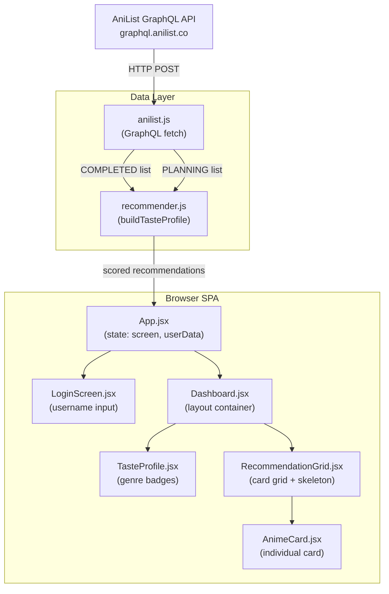

# Anime Recommender Dashboard — Implementation Plan

> **For agentic workers:** REQUIRED SUB-SKILL: Use superpowers:subagent-driven-development to implement this plan task-by-task. Steps use checkbox (`- [ ]`) syntax for tracking.

**Goal:** Build a React SPA that fetches a user's AniList anime lists, calculates a genre-based taste profile from their scores, and ranks their "Plan to Watch" list by predicted personal enjoyment.

**Architecture:** The app is a client-side SPA with no backend. It queries the AniList GraphQL API directly from the browser, processes the data in pure JS functions, and renders a two-screen UI (login → dashboard). All logic lives in `src/logic/recommender.js` (pure, testable), all API calls in `src/api/anilist.js` (isolated, mockable), and the UI in `src/components/` (presentational).

**Architecture Diagram:**



**Tech Stack:** React 19, Vite 7, Vanilla CSS (OKLCH tokens from DESIGN.md), Vitest + React Testing Library

## Global Constraints

- Node ≥ 20 (user has v26.3.1)
- No TypeScript — spec says plain JSX
- No state management libraries — React hooks only (`useState`, `useEffect`)
- No CSS frameworks — Vanilla CSS with OKLCH custom properties
- No backend — all data fetching happens client-side via `fetch()`
- AniList API endpoint: `https://graphql.anilist.co` (POST, no auth for public lists)
- Score format: `POINT_10_DECIMAL` (returns `Float`, unscored entries return `0`)
- Minimum genre threshold for taste profile: 2 anime

---

### Task 1: Project Scaffold + Design System CSS

**Files:**
- Create: `src/index.css`
- Create: `index.html` (overwrite Vite default)
- Scaffold: Vite + React project at project root

**Interfaces:**
- Consumes: nothing (first task)
- Produces: CSS custom properties (`--color-bg`, `--color-surface`, `--color-primary`, `--color-accent`, `--color-ink`, `--color-muted`, `--color-error`, `--color-success`, `--color-warning`, `--text-xs` through `--text-2xl`, `--radius-sm/md/lg/full`, `--transition-default`), global reset, base styles

- [ ] **Step 1: Scaffold Vite + React project**

```bash
npx -y create-vite@latest ./ --template react --no-interactive --overwrite
```

This overwrites the existing directory with a fresh React + Vite scaffold. It creates `package.json`, `vite.config.js`, `index.html`, `src/main.jsx`, `src/App.jsx`, etc.

- [ ] **Step 2: Install dependencies**

```bash
npm install
```

- [ ] **Step 3: Install Vitest and React Testing Library**

```bash
npm install -D vitest @testing-library/react @testing-library/jest-dom jsdom
```

- [ ] **Step 4: Configure Vitest**

Add test config to [vite.config.js](file:///C:/Sistemas/Projetos/animes/vite.config.js):

```js
import { defineConfig } from 'vite'
import react from '@vitejs/plugin-react'

export default defineConfig({
  plugins: [react()],
  test: {
    environment: 'jsdom',
    globals: true,
    setupFiles: './src/test-setup.js',
  },
})
```

Create [src/test-setup.js](file:///C:/Sistemas/Projetos/animes/src/test-setup.js):

```js
import '@testing-library/jest-dom'
```

- [ ] **Step 5: Write index.css with all DESIGN.md tokens**

Replace [src/index.css](file:///C:/Sistemas/Projetos/animes/src/index.css) with the full design system. All color values come directly from [DESIGN.md](file:///C:/Sistemas/Projetos/animes/DESIGN.md):

```css
@import url('https://fonts.googleapis.com/css2?family=Inter:wght@400;500;600;700&display=swap');

*,
*::before,
*::after {
  box-sizing: border-box;
  margin: 0;
  padding: 0;
}

:root {
  /* Color — OKLCH from DESIGN.md */
  --color-bg: oklch(0.08 0.000 0);
  --color-surface: oklch(0.14 0.005 240);
  --color-primary: oklch(0.72 0.14 195);
  --color-accent: oklch(0.72 0.14 75);
  --color-ink: oklch(0.93 0.005 240);
  --color-muted: oklch(0.60 0.005 240);
  --color-error: oklch(0.63 0.20 25);
  --color-success: oklch(0.72 0.17 155);
  --color-warning: oklch(0.80 0.15 85);

  /* Derived */
  --color-border: oklch(0.20 0.005 240);
  --color-primary-hover: oklch(0.77 0.14 195);
  --color-primary-active: oklch(0.67 0.14 195);
  --color-primary-glow: oklch(0.72 0.14 195 / 0.15);
  --color-primary-badge-bg: oklch(0.72 0.14 195 / 0.15);

  /* Typography */
  --font-family: 'Inter', system-ui, -apple-system, sans-serif;
  --text-xs: 0.694rem;
  --text-sm: 0.833rem;
  --text-base: 1rem;
  --text-md: 1.2rem;
  --text-lg: 1.44rem;
  --text-xl: 1.728rem;
  --text-2xl: 2.074rem;
  --line-height-body: 1.5;
  --line-height-heading: 1.2;

  /* Spacing */
  --space-1: 0.25rem;
  --space-2: 0.5rem;
  --space-3: 0.75rem;
  --space-4: 1rem;
  --space-6: 1.5rem;
  --space-8: 2rem;
  --space-12: 3rem;
  --space-16: 4rem;
  --space-24: 6rem;

  /* Radius */
  --radius-sm: 0.375rem;
  --radius-md: 0.75rem;
  --radius-lg: 1rem;
  --radius-full: 9999px;

  /* Motion */
  --transition-default: 200ms cubic-bezier(0.16, 1, 0.3, 1);

  /* Z-index scale */
  --z-dropdown: 100;
  --z-sticky: 200;
  --z-modal-backdrop: 300;
  --z-modal: 400;
  --z-toast: 500;
}

@media (prefers-reduced-motion: reduce) {
  :root {
    --transition-default: 0ms;
  }
}

html {
  font-size: 16px;
  -webkit-font-smoothing: antialiased;
  -moz-osx-font-smoothing: grayscale;
}

body {
  font-family: var(--font-family);
  font-size: var(--text-base);
  line-height: var(--line-height-body);
  color: var(--color-ink);
  background-color: var(--color-bg);
  min-height: 100vh;
}

h1, h2, h3 {
  line-height: var(--line-height-heading);
  text-wrap: balance;
}

p {
  max-width: 65ch;
  text-wrap: pretty;
}

img {
  display: block;
  max-width: 100%;
}

a {
  color: var(--color-primary);
  text-decoration: none;
}

:focus-visible {
  outline: 2px solid var(--color-primary);
  outline-offset: 2px;
}

/* Skeleton shimmer animation */
@keyframes shimmer {
  0% { background-position: -200% 0; }
  100% { background-position: 200% 0; }
}

.skeleton {
  background: linear-gradient(
    90deg,
    var(--color-surface) 25%,
    var(--color-border) 50%,
    var(--color-surface) 75%
  );
  background-size: 200% 100%;
  animation: shimmer 1.5s ease-in-out infinite;
  border-radius: var(--radius-sm);
}

@media (prefers-reduced-motion: reduce) {
  .skeleton {
    animation: none;
    background: var(--color-surface);
  }
}

/* Spinner animation */
@keyframes spin {
  to { transform: rotate(360deg); }
}
```

- [ ] **Step 6: Update index.html**

Replace [index.html](file:///C:/Sistemas/Projetos/animes/index.html):

```html
<!DOCTYPE html>
<html lang="pt-BR">
  <head>
    <meta charset="UTF-8" />
    <meta name="viewport" content="width=device-width, initial-scale=1.0" />
    <meta name="description" content="Recomendações personalizadas de anime baseadas no seu gosto real, não no que é popular." />
    <title>Anime Recommender — O que assistir agora</title>
    <link rel="icon" type="image/svg+xml" href="/vite.svg" />
  </head>
  <body>
    <div id="root"></div>
    <script type="module" src="/src/main.jsx"></script>
  </body>
</html>
```

- [ ] **Step 7: Clean up default Vite files**

Delete `src/App.css` and any default Vite assets that aren't needed. Simplify [src/App.jsx](file:///C:/Sistemas/Projetos/animes/src/App.jsx) to a placeholder:

```jsx
function App() {
  return <div>Anime Recommender</div>
}

export default App
```

Update [src/main.jsx](file:///C:/Sistemas/Projetos/animes/src/main.jsx):

```jsx
import { StrictMode } from 'react'
import { createRoot } from 'react-dom/client'
import './index.css'
import App from './App.jsx'

createRoot(document.getElementById('root')).render(
  <StrictMode>
    <App />
  </StrictMode>,
)
```

- [ ] **Step 8: Verify the app starts**

```bash
npm run dev
```

Expected: Vite dev server starts on `http://localhost:5173`. The page shows "Anime Recommender" on a near-black background with white text in Inter font.

- [ ] **Step 9: Run a smoke test to verify Vitest works**

Create `src/smoke.test.js`:

```js
describe('smoke', () => {
  it('runs', () => {
    expect(1 + 1).toBe(2)
  })
})
```

```bash
npx vitest run
```

Expected: 1 test passes. Delete `src/smoke.test.js` after.

- [ ] **Step 10: Commit**

```bash
git add -A
git commit -m "feat: scaffold Vite+React project with OKLCH design system tokens"
```

---

### Task 2: AniList API Client

**Files:**
- Create: [src/api/anilist.js](file:///C:/Sistemas/Projetos/animes/src/api/anilist.js)
- Create: [src/api/anilist.test.js](file:///C:/Sistemas/Projetos/animes/src/api/anilist.test.js)

**Interfaces:**
- Consumes: nothing
- Produces:
  - `fetchCompletedList(userName: string) → Promise<Array<{score: number, media: {id: number, title: {romaji: string, english: string|null}, genres: string[], coverImage: {large: string}}}>>`
  - `fetchPlanningList(userName: string) → Promise<Array<{media: {id: number, title: {romaji: string, english: string|null}, genres: string[], coverImage: {large: string}, averageScore: number|null, popularity: number|null}}>>`

- [ ] **Step 1: Write the failing tests**

Create [src/api/anilist.test.js](file:///C:/Sistemas/Projetos/animes/src/api/anilist.test.js):

```js
import { describe, it, expect, vi, beforeEach } from 'vitest'
import { fetchCompletedList, fetchPlanningList } from './anilist.js'

const mockFetch = vi.fn()
global.fetch = mockFetch

beforeEach(() => {
  mockFetch.mockReset()
})

describe('fetchCompletedList', () => {
  it('returns flat array of entries from a successful response', async () => {
    mockFetch.mockResolvedValueOnce({
      ok: true,
      json: () => Promise.resolve({
        data: {
          MediaListCollection: {
            lists: [
              {
                entries: [
                  {
                    score: 8.5,
                    media: {
                      id: 1,
                      title: { romaji: 'Shingeki no Kyojin', english: 'Attack on Titan' },
                      genres: ['Action', 'Drama'],
                      coverImage: { large: 'https://img.example.com/aot.jpg' },
                    },
                  },
                  {
                    score: 0,
                    media: {
                      id: 2,
                      title: { romaji: 'Naruto', english: 'Naruto' },
                      genres: ['Action', 'Adventure'],
                      coverImage: { large: 'https://img.example.com/naruto.jpg' },
                    },
                  },
                ],
              },
            ],
          },
        },
      }),
    })

    const result = await fetchCompletedList('testuser')

    expect(result).toHaveLength(2)
    expect(result[0].score).toBe(8.5)
    expect(result[0].media.title.english).toBe('Attack on Titan')
    expect(result[1].score).toBe(0)
  })

  it('throws an error when user is not found', async () => {
    mockFetch.mockResolvedValueOnce({
      ok: true,
      json: () => Promise.resolve({
        errors: [{ message: 'User not found', status: 404 }],
      }),
    })

    await expect(fetchCompletedList('nonexistent')).rejects.toThrow('Usuário não encontrado no AniList.')
  })

  it('throws an error when the list is private', async () => {
    mockFetch.mockResolvedValueOnce({
      ok: true,
      json: () => Promise.resolve({
        errors: [{ message: 'Private', status: 403 }],
      }),
    })

    await expect(fetchCompletedList('privateuser')).rejects.toThrow('A lista deste usuário é privada.')
  })

  it('throws on rate limit (HTTP 429)', async () => {
    mockFetch.mockResolvedValueOnce({
      ok: false,
      status: 429,
    })

    await expect(fetchCompletedList('testuser')).rejects.toThrow('O AniList está temporariamente indisponível.')
  })
})

describe('fetchPlanningList', () => {
  it('returns flat array of entries from a successful response', async () => {
    mockFetch.mockResolvedValueOnce({
      ok: true,
      json: () => Promise.resolve({
        data: {
          MediaListCollection: {
            lists: [
              {
                entries: [
                  {
                    media: {
                      id: 10,
                      title: { romaji: 'Made in Abyss', english: 'Made in Abyss' },
                      genres: ['Adventure', 'Fantasy'],
                      coverImage: { large: 'https://img.example.com/mia.jpg' },
                      averageScore: 84,
                      popularity: 120000,
                    },
                  },
                ],
              },
            ],
          },
        },
      }),
    })

    const result = await fetchPlanningList('testuser')

    expect(result).toHaveLength(1)
    expect(result[0].media.averageScore).toBe(84)
  })

  it('returns empty array when user has no planning list', async () => {
    mockFetch.mockResolvedValueOnce({
      ok: true,
      json: () => Promise.resolve({
        data: {
          MediaListCollection: {
            lists: [],
          },
        },
      }),
    })

    const result = await fetchPlanningList('testuser')

    expect(result).toEqual([])
  })
})
```

- [ ] **Step 2: Run tests to verify they fail**

```bash
npx vitest run src/api/anilist.test.js
```

Expected: FAIL — module `./anilist.js` not found.

- [ ] **Step 3: Implement anilist.js**

Create [src/api/anilist.js](file:///C:/Sistemas/Projetos/animes/src/api/anilist.js):

```js
const ANILIST_API = 'https://graphql.anilist.co'

const COMPLETED_QUERY = `
query ($userName: String) {
  MediaListCollection(userName: $userName, type: ANIME, status: COMPLETED) {
    lists {
      entries {
        score(format: POINT_10_DECIMAL)
        media {
          id
          title { romaji english }
          genres
          coverImage { large }
        }
      }
    }
  }
}
`

const PLANNING_QUERY = `
query ($userName: String) {
  MediaListCollection(userName: $userName, type: ANIME, status: PLANNING) {
    lists {
      entries {
        media {
          id
          title { romaji english }
          genres
          coverImage { large }
          averageScore
          popularity
        }
      }
    }
  }
}
`

async function queryAniList(query, variables) {
  const response = await fetch(ANILIST_API, {
    method: 'POST',
    headers: { 'Content-Type': 'application/json' },
    body: JSON.stringify({ query, variables }),
  })

  if (!response.ok) {
    if (response.status === 429) {
      throw new Error('O AniList está temporariamente indisponível.')
    }
    throw new Error('Erro ao conectar com o AniList.')
  }

  const json = await response.json()

  if (json.errors) {
    const error = json.errors[0]
    if (error.status === 404) {
      throw new Error('Usuário não encontrado no AniList.')
    }
    if (error.status === 403) {
      throw new Error('A lista deste usuário é privada.')
    }
    throw new Error(error.message || 'Erro desconhecido da API.')
  }

  return json.data
}

function flattenEntries(data) {
  const lists = data.MediaListCollection?.lists ?? []
  return lists.flatMap((list) => list.entries)
}

export async function fetchCompletedList(userName) {
  const data = await queryAniList(COMPLETED_QUERY, { userName })
  return flattenEntries(data)
}

export async function fetchPlanningList(userName) {
  const data = await queryAniList(PLANNING_QUERY, { userName })
  return flattenEntries(data)
}
```

- [ ] **Step 4: Run tests to verify they pass**

```bash
npx vitest run src/api/anilist.test.js
```

Expected: 6 tests pass.

- [ ] **Step 5: Commit**

```bash
git add src/api/
git commit -m "feat: add AniList GraphQL API client with error handling"
```

---

### Task 3: Recommendation Logic

**Files:**
- Create: [src/logic/recommender.js](file:///C:/Sistemas/Projetos/animes/src/logic/recommender.js)
- Create: [src/logic/recommender.test.js](file:///C:/Sistemas/Projetos/animes/src/logic/recommender.test.js)

**Interfaces:**
- Consumes: Output of `fetchCompletedList` and `fetchPlanningList` from Task 2 (array shapes)
- Produces:
  - `buildTasteProfile(completedEntries: Array) → Map<string, {average: number, count: number, scoredCount: number}>` — genre → stats, genres with scoredCount < 2 excluded
  - `scoreRecommendations(planningEntries: Array, tasteProfile: Map) → Array<{id, title, coverImage, genres, predictedScore, communityScore}>` — sorted descending by predictedScore, then communityScore

- [ ] **Step 1: Write the failing tests**

Create [src/logic/recommender.test.js](file:///C:/Sistemas/Projetos/animes/src/logic/recommender.test.js):

```js
import { describe, it, expect } from 'vitest'
import { buildTasteProfile, scoreRecommendations } from './recommender.js'

describe('buildTasteProfile', () => {
  it('calculates average score and tracks total vs scored count per genre', () => {
    const entries = [
      { score: 8, media: { genres: ['Action', 'Adventure'] } },
      { score: 6, media: { genres: ['Action', 'Drama'] } },
      { score: 9, media: { genres: ['Adventure', 'Fantasy'] } },
      { score: 0, media: { genres: ['Action'] } }, // completed but unscored
    ]

    const profile = buildTasteProfile(entries)

    expect(profile.get('Action')).toEqual({ average: 7, count: 3, scoredCount: 2 })
    expect(profile.get('Adventure')).toEqual({ average: 8.5, count: 2, scoredCount: 2 })
  })

  it('excludes genres with fewer than 2 scored anime', () => {
    const entries = [
      { score: 10, media: { genres: ['Mecha'] } },
      { score: 0, media: { genres: ['Mecha'] } }, // total 2, but only 1 scored
      { score: 8, media: { genres: ['Action'] } },
      { score: 7, media: { genres: ['Action'] } },
    ]

    const profile = buildTasteProfile(entries)

    expect(profile.has('Mecha')).toBe(false)
    expect(profile.has('Action')).toBe(true)
  })

  it('returns empty map when all entries are unscored', () => {
    const entries = [
      { score: 0, media: { genres: ['Action'] } },
      { score: 0, media: { genres: ['Drama'] } },
    ]

    const profile = buildTasteProfile(entries)

    expect(profile.size).toBe(0)
  })
})

describe('scoreRecommendations', () => {
  const tasteProfile = new Map([
    ['Action', { average: 5, count: 15, scoredCount: 10 }],
    ['Adventure', { average: 9, count: 5, scoredCount: 4 }],
    ['Drama', { average: 7, count: 8, scoredCount: 6 }],
  ])

  it('calculates predicted score from matching genre averages', () => {
    const planning = [
      {
        media: {
          id: 1,
          title: { romaji: 'Test A', english: 'Test A' },
          genres: ['Action', 'Adventure'],
          coverImage: { large: 'a.jpg' },
          averageScore: 80,
          popularity: 1000,
        },
      },
    ]

    const result = scoreRecommendations(planning, tasteProfile)

    expect(result[0].predictedScore).toBe(7) // (5 + 9) / 2
  })

  it('uses community averageScore as fallback when no genres match', () => {
    const planning = [
      {
        media: {
          id: 2,
          title: { romaji: 'Unknown Genre', english: null },
          genres: ['Mecha'],
          coverImage: { large: 'b.jpg' },
          averageScore: 75,
          popularity: 500,
        },
      },
    ]

    const result = scoreRecommendations(planning, tasteProfile)

    expect(result[0].predictedScore).toBe(7.5) // 75 / 10
  })

  it('sorts by predictedScore descending, then communityScore descending', () => {
    const planning = [
      {
        media: {
          id: 1, title: { romaji: 'Low', english: 'Low' },
          genres: ['Action'], coverImage: { large: '' },
          averageScore: 60, popularity: 100,
        },
      },
      {
        media: {
          id: 2, title: { romaji: 'High', english: 'High' },
          genres: ['Adventure'], coverImage: { large: '' },
          averageScore: 90, popularity: 200,
        },
      },
      {
        media: {
          id: 3, title: { romaji: 'Mid', english: 'Mid' },
          genres: ['Action', 'Drama'], coverImage: { large: '' },
          averageScore: 85, popularity: 150,
        },
      },
    ]

    const result = scoreRecommendations(planning, tasteProfile)

    expect(result.map((r) => r.id)).toEqual([2, 3, 1]) // 9, 6, 5
  })

  it('uses communityScore as tiebreaker', () => {
    const planning = [
      {
        media: {
          id: 1, title: { romaji: 'A', english: 'A' },
          genres: ['Action'], coverImage: { large: '' },
          averageScore: 70, popularity: 100,
        },
      },
      {
        media: {
          id: 2, title: { romaji: 'B', english: 'B' },
          genres: ['Action'], coverImage: { large: '' },
          averageScore: 90, popularity: 200,
        },
      },
    ]

    const result = scoreRecommendations(planning, tasteProfile)

    // Same predictedScore (5), B has higher communityScore (90 > 70)
    expect(result[0].id).toBe(2)
    expect(result[1].id).toBe(1)
  })

  it('returns title with english preferred, romaji fallback', () => {
    const planning = [
      {
        media: {
          id: 1, title: { romaji: 'Romaji Name', english: null },
          genres: ['Action'], coverImage: { large: '' },
          averageScore: 70, popularity: 100,
        },
      },
    ]

    const result = scoreRecommendations(planning, tasteProfile)

    expect(result[0].title).toBe('Romaji Name')
  })
})
```

- [ ] **Step 2: Run tests to verify they fail**

```bash
npx vitest run src/logic/recommender.test.js
```

Expected: FAIL — module `./recommender.js` not found.

- [ ] **Step 3: Implement recommender.js**

Create [src/logic/recommender.js](file:///C:/Sistemas/Projetos/animes/src/logic/recommender.js):

```js
const MIN_GENRE_COUNT = 2

export function buildTasteProfile(completedEntries) {
  const genreStats = new Map()

  for (const entry of completedEntries) {
    for (const genre of entry.media.genres) {
      if (!genreStats.has(genre)) {
        genreStats.set(genre, { total: 0, count: 0, scoredCount: 0 })
      }
      const stats = genreStats.get(genre)
      stats.count += 1

      if (entry.score > 0) {
        stats.total += entry.score
        stats.scoredCount += 1
      }
    }
  }

  const profile = new Map()

  for (const [genre, stats] of genreStats) {
    if (stats.scoredCount >= MIN_GENRE_COUNT) {
      profile.set(genre, {
        average: Math.round((stats.total / stats.scoredCount) * 10) / 10,
        count: stats.count,
        scoredCount: stats.scoredCount,
      })
    }
  }

  return profile
}

export function scoreRecommendations(planningEntries, tasteProfile) {
  const scored = planningEntries.map((entry) => {
    const { media } = entry
    const matchingGenres = media.genres.filter((g) => tasteProfile.has(g))

    let predictedScore
    if (matchingGenres.length > 0) {
      const sum = matchingGenres.reduce(
        (acc, g) => acc + tasteProfile.get(g).average,
        0
      )
      predictedScore = Math.round((sum / matchingGenres.length) * 10) / 10
    } else {
      predictedScore = media.averageScore != null
        ? Math.round((media.averageScore / 10) * 10) / 10
        : 0
    }

    const communityScore = media.averageScore != null
      ? Math.round((media.averageScore / 10) * 10) / 10
      : 0

    return {
      id: media.id,
      title: media.title.english || media.title.romaji,
      coverImage: media.coverImage.large,
      genres: media.genres,
      predictedScore,
      communityScore,
    }
  })

  scored.sort((a, b) => {
    if (b.predictedScore !== a.predictedScore) {
      return b.predictedScore - a.predictedScore
    }
    return b.communityScore - a.communityScore
  })

  return scored
}
```

- [ ] **Step 4: Run tests to verify they pass**

```bash
npx vitest run src/logic/recommender.test.js
```

Expected: 9 tests pass.

- [ ] **Step 5: Commit**

```bash
git add src/logic/
git commit -m "feat: add taste profile builder and recommendation scorer"
```

---

### Task 4: LoginScreen Component

**Files:**
- Create: [src/components/LoginScreen.jsx](file:///C:/Sistemas/Projetos/animes/src/components/LoginScreen.jsx)
- Create: [src/components/LoginScreen.css](file:///C:/Sistemas/Projetos/animes/src/components/LoginScreen.css)
- Create: [src/components/LoginScreen.test.jsx](file:///C:/Sistemas/Projetos/animes/src/components/LoginScreen.test.jsx)

**Interfaces:**
- Consumes: nothing
- Produces: `<LoginScreen onSubmit={(username: string) => void} isLoading={boolean} error={string|null} />` — renders username input, submit button, loading state, error message

- [ ] **Step 1: Write the failing tests**

Create [src/components/LoginScreen.test.jsx](file:///C:/Sistemas/Projetos/animes/src/components/LoginScreen.test.jsx):

```jsx
import { describe, it, expect, vi } from 'vitest'
import { render, screen, fireEvent } from '@testing-library/react'
import LoginScreen from './LoginScreen.jsx'

describe('LoginScreen', () => {
  it('renders username input and submit button', () => {
    render(<LoginScreen onSubmit={() => {}} isLoading={false} error={null} />)

    expect(screen.getByLabelText('Username do AniList')).toBeInTheDocument()
    expect(screen.getByRole('button', { name: /gerar recomendações/i })).toBeInTheDocument()
  })

  it('calls onSubmit with the username when form is submitted', () => {
    const onSubmit = vi.fn()
    render(<LoginScreen onSubmit={onSubmit} isLoading={false} error={null} />)

    fireEvent.change(screen.getByLabelText('Username do AniList'), {
      target: { value: 'testuser' },
    })
    fireEvent.click(screen.getByRole('button', { name: /gerar recomendações/i }))

    expect(onSubmit).toHaveBeenCalledWith('testuser')
  })

  it('does not call onSubmit when username is empty', () => {
    const onSubmit = vi.fn()
    render(<LoginScreen onSubmit={onSubmit} isLoading={false} error={null} />)

    fireEvent.click(screen.getByRole('button', { name: /gerar recomendações/i }))

    expect(onSubmit).not.toHaveBeenCalled()
  })

  it('disables the button and shows spinner when loading', () => {
    render(<LoginScreen onSubmit={() => {}} isLoading={true} error={null} />)

    const button = screen.getByRole('button')
    expect(button).toBeDisabled()
    expect(button.querySelector('.login-spinner')).toBeInTheDocument()
  })

  it('displays an error message when error prop is set', () => {
    render(<LoginScreen onSubmit={() => {}} isLoading={false} error="Usuário não encontrado no AniList." />)

    expect(screen.getByRole('alert')).toHaveTextContent('Usuário não encontrado no AniList.')
  })
})
```

- [ ] **Step 2: Run tests to verify they fail**

```bash
npx vitest run src/components/LoginScreen.test.jsx
```

Expected: FAIL — module `./LoginScreen.jsx` not found.

- [ ] **Step 3: Implement LoginScreen.jsx**

Create [src/components/LoginScreen.jsx](file:///C:/Sistemas/Projetos/animes/src/components/LoginScreen.jsx):

```jsx
import { useState } from 'react'
import './LoginScreen.css'

export default function LoginScreen({ onSubmit, isLoading, error }) {
  const [username, setUsername] = useState('')

  function handleSubmit(e) {
    e.preventDefault()
    const trimmed = username.trim()
    if (trimmed) {
      onSubmit(trimmed)
    }
  }

  return (
    <div className="login-screen">
      <div className="login-container">
        <h1 className="login-title">Anime Recommender</h1>
        <p className="login-subtitle">
          Descubra o que assistir baseado no seu gosto real.
        </p>
        <form className="login-form" onSubmit={handleSubmit}>
          <label htmlFor="username-input" className="login-label">
            Username do AniList
          </label>
          <input
            id="username-input"
            className={`login-input ${error ? 'login-input--error' : ''}`}
            type="text"
            value={username}
            onChange={(e) => setUsername(e.target.value)}
            placeholder="seu username"
            autoComplete="off"
            disabled={isLoading}
          />
          {error && (
            <p className="login-error" role="alert">
              {error}
            </p>
          )}
          <button
            className="login-button"
            type="submit"
            disabled={isLoading || !username.trim()}
          >
            {isLoading ? (
              <>
                <span className="login-spinner" aria-hidden="true" />
                Carregando…
              </>
            ) : (
              'Gerar Recomendações'
            )}
          </button>
        </form>
      </div>
    </div>
  )
}
```

- [ ] **Step 4: Implement LoginScreen.css**

Create [src/components/LoginScreen.css](file:///C:/Sistemas/Projetos/animes/src/components/LoginScreen.css):

```css
.login-screen {
  display: flex;
  align-items: center;
  justify-content: center;
  min-height: 100vh;
  padding: var(--space-4);
}

.login-container {
  width: 100%;
  max-width: 400px;
  text-align: center;
}

.login-title {
  font-size: var(--text-2xl);
  font-weight: 700;
  color: var(--color-primary);
  margin-bottom: var(--space-2);
}

.login-subtitle {
  font-size: var(--text-sm);
  color: var(--color-muted);
  margin-bottom: var(--space-8);
}

.login-form {
  display: flex;
  flex-direction: column;
  gap: var(--space-3);
}

.login-label {
  font-size: var(--text-sm);
  font-weight: 500;
  color: var(--color-ink);
  text-align: left;
}

.login-input {
  width: 100%;
  padding: var(--space-3) var(--space-4);
  font-family: var(--font-family);
  font-size: var(--text-base);
  color: var(--color-ink);
  background-color: var(--color-surface);
  border: 1px solid var(--color-muted);
  border-radius: var(--radius-sm);
  transition: border-color var(--transition-default),
              box-shadow var(--transition-default);
}

.login-input:focus {
  outline: none;
  border-color: var(--color-primary);
  box-shadow: 0 0 0 3px var(--color-primary-glow);
}

.login-input--error {
  border-color: var(--color-error);
}

.login-input::placeholder {
  color: var(--color-muted);
}

.login-error {
  font-size: var(--text-sm);
  color: var(--color-error);
  text-align: left;
}

.login-button {
  display: inline-flex;
  align-items: center;
  justify-content: center;
  gap: var(--space-2);
  width: 100%;
  padding: var(--space-3) var(--space-4);
  font-family: var(--font-family);
  font-size: var(--text-base);
  font-weight: 600;
  color: var(--color-ink);
  background-color: var(--color-primary);
  border: none;
  border-radius: var(--radius-sm);
  cursor: pointer;
  transition: background-color var(--transition-default);
}

.login-button:hover:not(:disabled) {
  background-color: var(--color-primary-hover);
}

.login-button:active:not(:disabled) {
  background-color: var(--color-primary-active);
}

.login-button:disabled {
  opacity: 0.4;
  cursor: not-allowed;
}

.login-spinner {
  display: inline-block;
  width: 1em;
  height: 1em;
  border: 2px solid var(--color-ink);
  border-top-color: transparent;
  border-radius: 50%;
  animation: spin 0.6s linear infinite;
}
```

- [ ] **Step 5: Run tests to verify they pass**

```bash
npx vitest run src/components/LoginScreen.test.jsx
```

Expected: 5 tests pass.

- [ ] **Step 6: Commit**

```bash
git add src/components/LoginScreen.jsx src/components/LoginScreen.css src/components/LoginScreen.test.jsx
git commit -m "feat: add LoginScreen component with input, loading, and error states"
```

---

### Task 5: Dashboard Components (TasteProfile, AnimeCard, RecommendationGrid)

**Files:**
- Create: [src/components/TasteProfile.jsx](file:///C:/Sistemas/Projetos/animes/src/components/TasteProfile.jsx)
- Create: [src/components/TasteProfile.css](file:///C:/Sistemas/Projetos/animes/src/components/TasteProfile.css)
- Create: [src/components/AnimeCard.jsx](file:///C:/Sistemas/Projetos/animes/src/components/AnimeCard.jsx)
- Create: [src/components/AnimeCard.css](file:///C:/Sistemas/Projetos/animes/src/components/AnimeCard.css)
- Create: [src/components/RecommendationGrid.jsx](file:///C:/Sistemas/Projetos/animes/src/components/RecommendationGrid.jsx)
- Create: [src/components/RecommendationGrid.css](file:///C:/Sistemas/Projetos/animes/src/components/RecommendationGrid.css)
- Create: [src/components/Dashboard.jsx](file:///C:/Sistemas/Projetos/animes/src/components/Dashboard.jsx)
- Create: [src/components/Dashboard.css](file:///C:/Sistemas/Projetos/animes/src/components/Dashboard.css)
- Create: [src/components/Dashboard.test.jsx](file:///C:/Sistemas/Projetos/animes/src/components/Dashboard.test.jsx)

**Interfaces:**
- Consumes:
  - `tasteProfile: Map<string, {average: number, count: number}>` from Task 3
  - `recommendations: Array<{id, title, coverImage, genres, predictedScore, communityScore}>` from Task 3
- Produces:
  - `<TasteProfile profile={Map} />` — renders top 5 genre badges
  - `<AnimeCard anime={object} />` — renders a single recommendation card
  - `<RecommendationGrid recommendations={Array} isLoading={boolean} />` — renders grid of cards or skeleton
  - `<Dashboard tasteProfile={Map} recommendations={Array} username={string} onLogout={() => void} isLoading={boolean} />` — composes all sections

- [ ] **Step 1: Write the failing tests**

Create [src/components/Dashboard.test.jsx](file:///C:/Sistemas/Projetos/animes/src/components/Dashboard.test.jsx):

```jsx
import { describe, it, expect, vi } from 'vitest'
import { render, screen, fireEvent } from '@testing-library/react'
import Dashboard from './Dashboard.jsx'

const mockProfile = new Map([
  ['Adventure', { average: 9.0, count: 5 }],
  ['Drama', { average: 8.5, count: 8 }],
  ['Action', { average: 7.0, count: 15 }],
  ['Fantasy', { average: 6.5, count: 3 }],
  ['Comedy', { average: 6.0, count: 4 }],
  ['Slice of Life', { average: 5.0, count: 2 }],
])

const mockRecommendations = [
  {
    id: 1,
    title: 'Made in Abyss',
    coverImage: 'https://img.example.com/mia.jpg',
    genres: ['Adventure', 'Fantasy'],
    predictedScore: 7.8,
    communityScore: 8.4,
  },
  {
    id: 2,
    title: 'Steins;Gate',
    coverImage: 'https://img.example.com/sg.jpg',
    genres: ['Drama', 'Sci-Fi'],
    predictedScore: 8.5,
    communityScore: 9.1,
  },
]

describe('Dashboard', () => {
  it('renders the username in the header', () => {
    render(
      <Dashboard
        tasteProfile={mockProfile}
        recommendations={mockRecommendations}
        username="testuser"
        onLogout={() => {}}
        isLoading={false}
      />
    )

    expect(screen.getByText('testuser')).toBeInTheDocument()
  })

  it('renders top 5 genre badges sorted by average', () => {
    render(
      <Dashboard
        tasteProfile={mockProfile}
        recommendations={mockRecommendations}
        username="testuser"
        onLogout={() => {}}
        isLoading={false}
      />
    )

    expect(screen.getByText(/Adventure/)).toBeInTheDocument()
    expect(screen.getByText(/Drama/)).toBeInTheDocument()
    expect(screen.getByText(/Action/)).toBeInTheDocument()
    // "Slice of Life" is the 6th genre, should NOT appear (top 5 only)
    expect(screen.queryByText(/Slice of Life/)).not.toBeInTheDocument()
  })

  it('renders recommendation cards', () => {
    render(
      <Dashboard
        tasteProfile={mockProfile}
        recommendations={mockRecommendations}
        username="testuser"
        onLogout={() => {}}
        isLoading={false}
      />
    )

    expect(screen.getByText('Made in Abyss')).toBeInTheDocument()
    expect(screen.getByText('Steins;Gate')).toBeInTheDocument()
  })

  it('calls onLogout when the logout button is clicked', () => {
    const onLogout = vi.fn()
    render(
      <Dashboard
        tasteProfile={mockProfile}
        recommendations={mockRecommendations}
        username="testuser"
        onLogout={onLogout}
        isLoading={false}
      />
    )

    fireEvent.click(screen.getByRole('button', { name: /trocar conta/i }))

    expect(onLogout).toHaveBeenCalled()
  })

  it('renders skeleton cards when loading', () => {
    const { container } = render(
      <Dashboard
        tasteProfile={new Map()}
        recommendations={[]}
        username="testuser"
        onLogout={() => {}}
        isLoading={true}
      />
    )

    const skeletons = container.querySelectorAll('.skeleton')
    expect(skeletons.length).toBeGreaterThan(0)
  })
})
```

- [ ] **Step 2: Run tests to verify they fail**

```bash
npx vitest run src/components/Dashboard.test.jsx
```

Expected: FAIL — module `./Dashboard.jsx` not found.

- [ ] **Step 3: Implement TasteProfile**

Create [src/components/TasteProfile.jsx](file:///C:/Sistemas/Projetos/animes/src/components/TasteProfile.jsx):

```jsx
import './TasteProfile.css'

export default function TasteProfile({ profile }) {
  const sorted = [...profile.entries()]
    .sort((a, b) => b[1].average - a[1].average)
    .slice(0, 5)

  return (
    <section className="taste-profile">
      <h2 className="taste-profile__title">Seu Perfil de Gosto</h2>
      <div className="taste-profile__badges">
        {sorted.map(([genre, stats], index) => (
          <span
            key={genre}
            className={`taste-badge ${index < 3 ? 'taste-badge--filled' : 'taste-badge--outline'}`}
          >
            {genre} ★ {stats.average.toFixed(1)}
          </span>
        ))}
      </div>
    </section>
  )
}
```

Create [src/components/TasteProfile.css](file:///C:/Sistemas/Projetos/animes/src/components/TasteProfile.css):

```css
.taste-profile {
  margin-bottom: var(--space-12);
}

.taste-profile__title {
  font-size: var(--text-lg);
  font-weight: 600;
  margin-bottom: var(--space-4);
}

.taste-profile__badges {
  display: flex;
  flex-wrap: wrap;
  gap: var(--space-2);
}

.taste-badge {
  display: inline-flex;
  align-items: center;
  padding: var(--space-2) var(--space-3);
  font-size: var(--text-sm);
  font-weight: 500;
  border-radius: var(--radius-full);
  white-space: nowrap;
}

.taste-badge--filled {
  background-color: var(--color-primary);
  color: var(--color-ink);
}

.taste-badge--outline {
  background-color: var(--color-primary-badge-bg);
  color: var(--color-primary);
}
```

- [ ] **Step 4: Implement AnimeCard**

Create [src/components/AnimeCard.jsx](file:///C:/Sistemas/Projetos/animes/src/components/AnimeCard.jsx):

```jsx
import './AnimeCard.css'

export default function AnimeCard({ anime }) {
  return (
    <article className="anime-card">
      <div className="anime-card__image-wrapper">
        
      </div>
      <div className="anime-card__body">
        <h3 className="anime-card__title">{anime.title}</h3>
        <p className="anime-card__predicted">
          Match: {anime.predictedScore.toFixed(1)}/10
        </p>
        <p className="anime-card__community">
          Comunidade: {anime.communityScore.toFixed(1)}/10
        </p>
        <div className="anime-card__genres">
          {anime.genres.map((genre) => (
            <span key={genre} className="anime-card__genre-pill">
              {genre}
            </span>
          ))}
        </div>
      </div>
    </article>
  )
}
```

Create [src/components/AnimeCard.css](file:///C:/Sistemas/Projetos/animes/src/components/AnimeCard.css):

```css
.anime-card {
  background-color: var(--color-surface);
  border: 1px solid var(--color-border);
  border-radius: var(--radius-md);
  overflow: hidden;
  transition: box-shadow var(--transition-default);
}

.anime-card:hover {
  box-shadow: 0 0 20px 2px var(--color-primary-glow);
}

.anime-card__image-wrapper {
  aspect-ratio: 3 / 4;
  overflow: hidden;
}

.anime-card__image {
  width: 100%;
  height: 100%;
  object-fit: cover;
}

.anime-card__body {
  padding: var(--space-3);
}

.anime-card__title {
  font-size: var(--text-base);
  font-weight: 600;
  line-height: var(--line-height-heading);
  margin-bottom: var(--space-1);
  overflow: hidden;
  text-overflow: ellipsis;
  display: -webkit-box;
  -webkit-line-clamp: 2;
  -webkit-box-orient: vertical;
}

.anime-card__predicted {
  font-size: var(--text-base);
  font-weight: 600;
  color: var(--color-primary);
  margin-bottom: var(--space-1);
}

.anime-card__community {
  font-size: var(--text-sm);
  color: var(--color-muted);
  margin-bottom: var(--space-2);
}

.anime-card__genres {
  display: flex;
  flex-wrap: wrap;
  gap: var(--space-1);
}

.anime-card__genre-pill {
  font-size: var(--text-xs);
  padding: var(--space-1) var(--space-2);
  background-color: var(--color-bg);
  border: 1px solid var(--color-border);
  border-radius: var(--radius-full);
  color: var(--color-muted);
}
```

- [ ] **Step 5: Implement RecommendationGrid**

Create [src/components/RecommendationGrid.jsx](file:///C:/Sistemas/Projetos/animes/src/components/RecommendationGrid.jsx):

```jsx
import AnimeCard from './AnimeCard.jsx'
import './RecommendationGrid.css'

function SkeletonCard() {
  return (
    <div className="anime-card anime-card--skeleton">
      <div className="anime-card__image-wrapper skeleton" />
      <div className="anime-card__body">
        <div className="skeleton" style={{ height: '1.2rem', width: '80%', marginBottom: 'var(--space-2)' }} />
        <div className="skeleton" style={{ height: '1rem', width: '50%', marginBottom: 'var(--space-1)' }} />
        <div className="skeleton" style={{ height: '0.8rem', width: '40%' }} />
      </div>
    </div>
  )
}

export default function RecommendationGrid({ recommendations, isLoading }) {
  return (
    <section className="recommendation-grid">
      <h2 className="recommendation-grid__title">
        Recomendações — O Que Assistir Agora
      </h2>
      <div className="recommendation-grid__grid">
        {isLoading
          ? Array.from({ length: 8 }, (_, i) => <SkeletonCard key={i} />)
          : recommendations.map((anime) => (
              <AnimeCard key={anime.id} anime={anime} />
            ))}
      </div>
    </section>
  )
}
```

Create [src/components/RecommendationGrid.css](file:///C:/Sistemas/Projetos/animes/src/components/RecommendationGrid.css):

```css
.recommendation-grid__title {
  font-size: var(--text-lg);
  font-weight: 600;
  margin-bottom: var(--space-4);
}

.recommendation-grid__grid {
  display: grid;
  grid-template-columns: repeat(auto-fit, minmax(200px, 1fr));
  gap: var(--space-6);
}
```

- [ ] **Step 6: Implement Dashboard**

Create [src/components/Dashboard.jsx](file:///C:/Sistemas/Projetos/animes/src/components/Dashboard.jsx):

```jsx
import TasteProfile from './TasteProfile.jsx'
import RecommendationGrid from './RecommendationGrid.jsx'
import './Dashboard.css'

export default function Dashboard({ tasteProfile, recommendations, username, onLogout, isLoading }) {
  return (
    <div className="dashboard">
      <header className="dashboard__header">
        <span className="dashboard__username">{username}</span>
        <button className="dashboard__logout" onClick={onLogout}>
          Trocar conta
        </button>
      </header>
      <main className="dashboard__main">
        {!isLoading && tasteProfile.size > 0 && (
          <TasteProfile profile={tasteProfile} />
        )}
        <RecommendationGrid
          recommendations={recommendations}
          isLoading={isLoading}
        />
      </main>
    </div>
  )
}
```

Create [src/components/Dashboard.css](file:///C:/Sistemas/Projetos/animes/src/components/Dashboard.css):

```css
.dashboard {
  max-width: 1200px;
  margin: 0 auto;
  padding: var(--space-4);
}

.dashboard__header {
  display: flex;
  align-items: center;
  justify-content: space-between;
  padding: var(--space-4) 0;
  margin-bottom: var(--space-8);
  border-bottom: 1px solid var(--color-border);
}

.dashboard__username {
  font-size: var(--text-md);
  font-weight: 600;
  color: var(--color-primary);
}

.dashboard__logout {
  font-family: var(--font-family);
  font-size: var(--text-sm);
  font-weight: 500;
  color: var(--color-muted);
  background: none;
  border: 1px solid var(--color-border);
  border-radius: var(--radius-sm);
  padding: var(--space-2) var(--space-3);
  cursor: pointer;
  transition: border-color var(--transition-default),
              color var(--transition-default);
}

.dashboard__logout:hover {
  color: var(--color-ink);
  border-color: var(--color-muted);
}

.dashboard__main {
  padding-bottom: var(--space-16);
}
```

- [ ] **Step 7: Run tests to verify they pass**

```bash
npx vitest run src/components/Dashboard.test.jsx
```

Expected: 5 tests pass.

- [ ] **Step 8: Commit**

```bash
git add src/components/
git commit -m "feat: add Dashboard, TasteProfile, RecommendationGrid, and AnimeCard components"
```

---

### Task 6: App Integration (Wire Everything Together)

**Files:**
- Modify: [src/App.jsx](file:///C:/Sistemas/Projetos/animes/src/App.jsx)
- Create: [src/App.test.jsx](file:///C:/Sistemas/Projetos/animes/src/App.test.jsx)

**Interfaces:**
- Consumes: all previous tasks
  - `fetchCompletedList(userName)` and `fetchPlanningList(userName)` from [src/api/anilist.js](file:///C:/Sistemas/Projetos/animes/src/api/anilist.js)
  - `buildTasteProfile(entries)` and `scoreRecommendations(entries, profile)` from [src/logic/recommender.js](file:///C:/Sistemas/Projetos/animes/src/logic/recommender.js)
  - `<LoginScreen onSubmit isLoading error />` from [src/components/LoginScreen.jsx](file:///C:/Sistemas/Projetos/animes/src/components/LoginScreen.jsx)
  - `<Dashboard tasteProfile recommendations username onLogout isLoading />` from [src/components/Dashboard.jsx](file:///C:/Sistemas/Projetos/animes/src/components/Dashboard.jsx)
- Produces: complete working application

- [ ] **Step 1: Write the failing tests**

Create [src/App.test.jsx](file:///C:/Sistemas/Projetos/animes/src/App.test.jsx):

```jsx
import { describe, it, expect, vi, beforeEach } from 'vitest'
import { render, screen, fireEvent, waitFor } from '@testing-library/react'
import App from './App.jsx'

// Mock the API module
vi.mock('./api/anilist.js', () => ({
  fetchCompletedList: vi.fn(),
  fetchPlanningList: vi.fn(),
}))

import { fetchCompletedList, fetchPlanningList } from './api/anilist.js'

const completedData = [
  { score: 9, media: { id: 1, title: { romaji: 'A', english: 'A' }, genres: ['Adventure', 'Fantasy'], coverImage: { large: '' } } },
  { score: 8, media: { id: 2, title: { romaji: 'B', english: 'B' }, genres: ['Adventure', 'Drama'], coverImage: { large: '' } } },
  { score: 5, media: { id: 3, title: { romaji: 'C', english: 'C' }, genres: ['Action'], coverImage: { large: '' } } },
  { score: 4, media: { id: 4, title: { romaji: 'D', english: 'D' }, genres: ['Action'], coverImage: { large: '' } } },
]

const planningData = [
  { media: { id: 10, title: { romaji: 'Rec1', english: 'Rec1' }, genres: ['Adventure'], coverImage: { large: 'r1.jpg' }, averageScore: 85, popularity: 100 } },
  { media: { id: 11, title: { romaji: 'Rec2', english: 'Rec2' }, genres: ['Action'], coverImage: { large: 'r2.jpg' }, averageScore: 70, popularity: 50 } },
]

beforeEach(() => {
  fetchCompletedList.mockReset()
  fetchPlanningList.mockReset()
})

describe('App', () => {
  it('shows login screen initially', () => {
    render(<App />)

    expect(screen.getByLabelText('Username do AniList')).toBeInTheDocument()
  })

  it('transitions to dashboard after successful login', async () => {
    fetchCompletedList.mockResolvedValueOnce(completedData)
    fetchPlanningList.mockResolvedValueOnce(planningData)

    render(<App />)

    fireEvent.change(screen.getByLabelText('Username do AniList'), {
      target: { value: 'testuser' },
    })
    fireEvent.click(screen.getByRole('button', { name: /gerar recomendações/i }))

    await waitFor(() => {
      expect(screen.getByText('testuser')).toBeInTheDocument()
    })

    expect(screen.getByText('Rec1')).toBeInTheDocument()
  })

  it('shows error on login screen when API fails', async () => {
    fetchCompletedList.mockRejectedValueOnce(new Error('Usuário não encontrado no AniList.'))

    render(<App />)

    fireEvent.change(screen.getByLabelText('Username do AniList'), {
      target: { value: 'baduser' },
    })
    fireEvent.click(screen.getByRole('button', { name: /gerar recomendações/i }))

    await waitFor(() => {
      expect(screen.getByRole('alert')).toHaveTextContent('Usuário não encontrado no AniList.')
    })
  })

  it('returns to login screen when logout is clicked', async () => {
    fetchCompletedList.mockResolvedValueOnce(completedData)
    fetchPlanningList.mockResolvedValueOnce(planningData)

    render(<App />)

    fireEvent.change(screen.getByLabelText('Username do AniList'), {
      target: { value: 'testuser' },
    })
    fireEvent.click(screen.getByRole('button', { name: /gerar recomendações/i }))

    await waitFor(() => {
      expect(screen.getByText('testuser')).toBeInTheDocument()
    })

    fireEvent.click(screen.getByRole('button', { name: /trocar conta/i }))

    expect(screen.getByLabelText('Username do AniList')).toBeInTheDocument()
  })

  it('shows error when completed list has no scored anime', async () => {
    fetchCompletedList.mockResolvedValueOnce([
      { score: 0, media: { id: 1, title: { romaji: 'X', english: 'X' }, genres: ['Action'], coverImage: { large: '' } } },
    ])
    fetchPlanningList.mockResolvedValueOnce(planningData)

    render(<App />)

    fireEvent.change(screen.getByLabelText('Username do AniList'), {
      target: { value: 'testuser' },
    })
    fireEvent.click(screen.getByRole('button', { name: /gerar recomendações/i }))

    await waitFor(() => {
      expect(screen.getByRole('alert')).toHaveTextContent('Avalie mais animes no AniList')
    })
  })

  it('shows error when planning list is empty', async () => {
    fetchCompletedList.mockResolvedValueOnce(completedData)
    fetchPlanningList.mockResolvedValueOnce([])

    render(<App />)

    fireEvent.change(screen.getByLabelText('Username do AniList'), {
      target: { value: 'testuser' },
    })
    fireEvent.click(screen.getByRole('button', { name: /gerar recomendações/i }))

    await waitFor(() => {
      expect(screen.getByRole('alert')).toHaveTextContent("Adicione animes à sua lista 'Planning'")
    })
  })
})
```

- [ ] **Step 2: Run tests to verify they fail**

```bash
npx vitest run src/App.test.jsx
```

Expected: FAIL — tests fail because `App.jsx` is the placeholder from Task 1.

- [ ] **Step 3: Implement App.jsx**

Replace [src/App.jsx](file:///C:/Sistemas/Projetos/animes/src/App.jsx):

```jsx
import { useState } from 'react'
import { fetchCompletedList, fetchPlanningList } from './api/anilist.js'
import { buildTasteProfile, scoreRecommendations } from './logic/recommender.js'
import LoginScreen from './components/LoginScreen.jsx'
import Dashboard from './components/Dashboard.jsx'

export default function App() {
  const [screen, setScreen] = useState('login')
  const [isLoading, setIsLoading] = useState(false)
  const [error, setError] = useState(null)
  const [username, setUsername] = useState('')
  const [tasteProfile, setTasteProfile] = useState(new Map())
  const [recommendations, setRecommendations] = useState([])

  async function handleLogin(inputUsername) {
    setIsLoading(true)
    setError(null)

    try {
      const [completed, planning] = await Promise.all([
        fetchCompletedList(inputUsername),
        fetchPlanningList(inputUsername),
      ])

      const profile = buildTasteProfile(completed)

      if (profile.size === 0) {
        setError('Avalie mais animes no AniList para gerar seu perfil de gosto.')
        setIsLoading(false)
        return
      }

      if (planning.length === 0) {
        setError("Adicione animes à sua lista 'Planning' no AniList.")
        setIsLoading(false)
        return
      }

      const scored = scoreRecommendations(planning, profile)

      setUsername(inputUsername)
      setTasteProfile(profile)
      setRecommendations(scored)
      setScreen('dashboard')
    } catch (err) {
      setError(err.message)
    } finally {
      setIsLoading(false)
    }
  }

  function handleLogout() {
    setScreen('login')
    setUsername('')
    setTasteProfile(new Map())
    setRecommendations([])
    setError(null)
  }

  if (screen === 'login') {
    return (
      <LoginScreen
        onSubmit={handleLogin}
        isLoading={isLoading}
        error={error}
      />
    )
  }

  return (
    <Dashboard
      tasteProfile={tasteProfile}
      recommendations={recommendations}
      username={username}
      onLogout={handleLogout}
      isLoading={isLoading}
    />
  )
}
```

- [ ] **Step 4: Run ALL tests to verify they pass**

```bash
npx vitest run
```

Expected: All tests pass (across all test files: anilist, recommender, LoginScreen, Dashboard, App).

- [ ] **Step 5: Manual verification**

```bash
npm run dev
```

1. Open `http://localhost:5173`
2. Verify login screen renders with dark background, cyan title, input field
3. Enter a valid AniList username (e.g. your own)
4. Verify dashboard loads with taste profile badges and recommendation grid
5. Verify "Trocar conta" button returns to login
6. Test with an invalid username — verify error message appears

- [ ] **Step 6: Commit**

```bash
git add src/App.jsx src/App.test.jsx
git commit -m "feat: wire App.jsx with login flow, API calls, and dashboard rendering"
```
