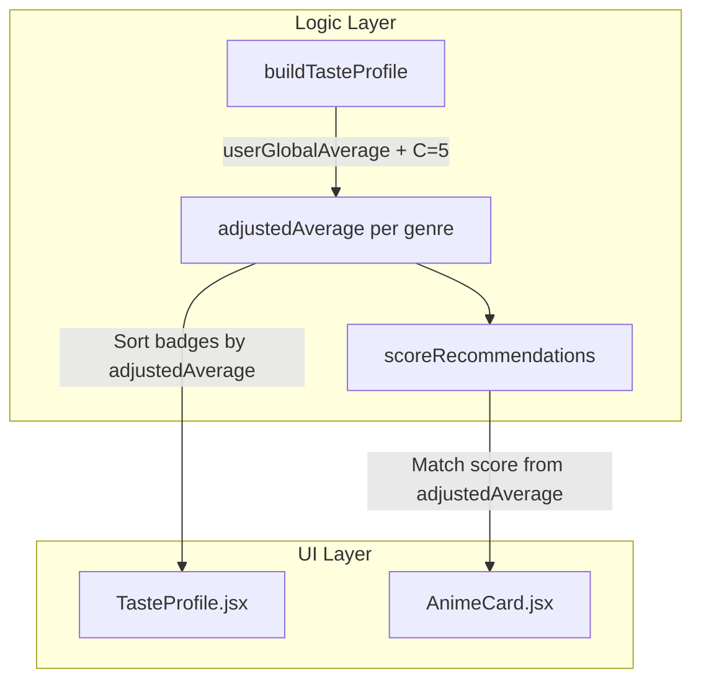

# Bayesian Taste Profile & Recommendation Weighting Implementation Plan

> **For agentic workers:** REQUIRED SUB-SKILL: Use superpowers:subagent-driven-development to implement this plan task-by-task. Steps use checkbox (`- [ ]`) syntax for tracking.

**Goal:** Implement Bayesian Average (dampened average with $C=5$) for genre taste profile calculations and recommendation match scoring, so that volume of watched anime properly weights user genre preferences.

**Architecture:** Update pure logic in `src/logic/recommender.js` to compute `userGlobalAverage` across all valid completed ratings (`score > 0`) and calculate `adjustedAverage` per genre. Update `TasteProfile.jsx` to sort badges by `adjustedAverage`.

**Architecture Diagram:**



**Tech Stack:** React 19, Vanilla CSS, Vitest

## Global Constraints

- Pure JS logic in `recommender.js` without external library dependencies
- Constante de confiança $C = 5$
- TDD required: tests first, then implementation

---

### Task 1: Update `buildTasteProfile` in `recommender.js`

**Files:**
- Modify: [src/logic/recommender.js](file:///C:/Sistemas/Projetos/animes/src/logic/recommender.js)
- Modify: [src/logic/recommender.test.js](file:///C:/Sistemas/Projetos/animes/src/logic/recommender.test.js)

**Interfaces:**
- Consumes: `completedEntries`
- Produces: `buildTasteProfile(completedEntries) → Map<string, {average: number, adjustedAverage: number, count: number, scoredCount: number}>`

- [ ] **Step 1: Write failing unit test for Bayesian average in recommender.test.js**

Add to [src/logic/recommender.test.js](file:///C:/Sistemas/Projetos/animes/src/logic/recommender.test.js):

```js
  it('calculates Bayesian adjustedAverage using user global average and C=5', () => {
    // User has 10 anime in total with average = 7.0
    // Genre Action: 15 entries, sum = 124.95 -> real average = 8.33 -> adjusted = (5*7.0 + 124.95) / 20 = 7.99 -> 8.0
    // Genre Fantasy: 114 entries, sum = 931.38 -> real average = 8.17 -> adjusted = (5*7.0 + 931.38) / 119 = 8.12 -> 8.1
    const entries = [
      ...Array.from({ length: 15 }, () => ({ score: 8.33, media: { genres: ['Action'] } })),
      ...Array.from({ length: 114 }, () => ({ score: 8.17, media: { genres: ['Fantasy'] } })),
    ]

    const profile = buildTasteProfile(entries)

    expect(profile.get('Action').adjustedAverage).toBe(8.0)
    expect(profile.get('Fantasy').adjustedAverage).toBe(8.1)
    // Fantasy has higher adjustedAverage than Action because of volume!
    expect(profile.get('Fantasy').adjustedAverage).toBeGreaterThan(profile.get('Action').adjustedAverage)
  })
```

- [ ] **Step 2: Run test to verify failure**

```bash
npx vitest run src/logic/recommender.test.js
```

Expected: FAIL — `adjustedAverage` is undefined.

- [ ] **Step 3: Update `buildTasteProfile` in recommender.js**

Modify [src/logic/recommender.js](file:///C:/Sistemas/Projetos/animes/src/logic/recommender.js):

```js
const MIN_GENRE_COUNT = 2
const CONFIDENCE_CONSTANT = 5

export function buildTasteProfile(completedEntries = []) {
  const genreStats = new Map()
  let globalTotal = 0
  let globalScoredCount = 0

  for (const entry of completedEntries) {
    if (!entry?.media) continue
    const genres = entry.media.genres ?? []
    const score = entry.score ?? 0

    if (score > 0) {
      globalTotal += score
      globalScoredCount += 1
    }

    for (const genre of genres) {
      if (!genreStats.has(genre)) {
        genreStats.set(genre, { total: 0, count: 0, scoredCount: 0 })
      }
      const stats = genreStats.get(genre)
      stats.count += 1

      if (score > 0) {
        stats.total += score
        stats.scoredCount += 1
      }
    }
  }

  const userGlobalAverage = globalScoredCount > 0 ? globalTotal / globalScoredCount : 7.0

  const profile = new Map()

  for (const [genre, stats] of genreStats) {
    if (stats.scoredCount >= MIN_GENRE_COUNT) {
      const realAverage = stats.total / stats.scoredCount
      const adjustedAverage =
        (CONFIDENCE_CONSTANT * userGlobalAverage + stats.total) /
        (CONFIDENCE_CONSTANT + stats.scoredCount)

      profile.set(genre, {
        average: Math.round(realAverage * 10) / 10,
        adjustedAverage: Math.round(adjustedAverage * 10) / 10,
        count: stats.count,
        scoredCount: stats.scoredCount,
      })
    }
  }

  return profile
}
```

- [ ] **Step 4: Run tests to verify they pass**

```bash
npx vitest run src/logic/recommender.test.js
```

Expected: PASS

- [ ] **Step 5: Commit**

```bash
git add src/logic/
git commit -m "feat: implement Bayesian average calculation in buildTasteProfile"
```

---

### Task 2: Update `scoreRecommendations` to use `adjustedAverage`

**Files:**
- Modify: [src/logic/recommender.js](file:///C:/Sistemas/Projetos/animes/src/logic/recommender.js)
- Modify: [src/logic/recommender.test.js](file:///C:/Sistemas/Projetos/animes/src/logic/recommender.test.js)

**Interfaces:**
- Consumes: `planningEntries`, `tasteProfile` (with `adjustedAverage`)
- Produces: `scoreRecommendations` using `adjustedAverage` for `predictedScore`

- [ ] **Step 1: Update `scoreRecommendations` in recommender.js**

Modify `scoreRecommendations` in [src/logic/recommender.js](file:///C:/Sistemas/Projetos/animes/src/logic/recommender.js):

```js
export function scoreRecommendations(planningEntries = [], tasteProfile = new Map()) {
  const scored = planningEntries.map((entry) => {
    const media = entry?.media ?? {}
    const genres = media?.genres ?? []
    const matchingGenres = genres.filter((g) => tasteProfile.has(g))

    let predictedScore
    if (matchingGenres.length > 0) {
      const sum = matchingGenres.reduce(
        (acc, g) => acc + tasteProfile.get(g).adjustedAverage,
        0
      )
      predictedScore = Math.round((sum / matchingGenres.length) * 10) / 10
    } else {
      predictedScore = media.averageScore != null
        ? Math.round((media.averageScore / 10) * 10) / 10
        : 0
    }

    const communityScore = media.averageScore != null
      ? Math.round((media.averageScore / 10) * 10) / 10
      : 0

    return {
      id: media.id,
      title: media.title?.english || media.title?.romaji || 'Untitled',
      coverImage: media.coverImage?.large ?? '',
      genres,
      predictedScore,
      communityScore,
    }
  })

  scored.sort((a, b) => {
    if (b.predictedScore !== a.predictedScore) {
      return b.predictedScore - a.predictedScore
    }
    return b.communityScore - a.communityScore
  })

  return scored
}
```

- [ ] **Step 2: Update existing unit tests for adjustedAverage**

In [src/logic/recommender.test.js](file:///C:/Sistemas/Projetos/animes/src/logic/recommender.test.js), update mock profiles to include `adjustedAverage` so all recommender tests remain green.

- [ ] **Step 3: Run tests to verify they pass**

```bash
npx vitest run src/logic/recommender.test.js
```

- [ ] **Step 4: Commit**

```bash
git add src/logic/
git commit -m "feat: update scoreRecommendations to use Bayesian adjustedAverage"
```

---

### Task 3: Update `TasteProfile.jsx` Badge Sorting

**Files:**
- Modify: [src/components/TasteProfile.jsx](file:///C:/Sistemas/Projetos/animes/src/components/TasteProfile.jsx)
- Modify: [src/components/Dashboard.test.jsx](file:///C:/Sistemas/Projetos/animes/src/components/Dashboard.test.jsx)

- [ ] **Step 1: Update `TasteProfile.jsx` to sort by `adjustedAverage`**

Modify [src/components/TasteProfile.jsx](file:///C:/Sistemas/Projetos/animes/src/components/TasteProfile.jsx):

```jsx
import './TasteProfile.css'

export default function TasteProfile({ profile = new Map() }) {
  const sorted = [...profile.entries()]
    .sort((a, b) => (b[1].adjustedAverage ?? b[1].average) - (a[1].adjustedAverage ?? a[1].average))
    .slice(0, 5)

  return (
    <section className="taste-profile">
      <h2 className="taste-profile__title">Seu Perfil de Gosto</h2>
      <div className="taste-profile__badges">
        {sorted.map(([genre, stats], index) => (
          <span
            key={genre}
            className={`taste-badge ${index < 3 ? 'taste-badge--filled' : 'taste-badge--outline'}`}
          >
            {genre} ★ {stats.average.toFixed(1)} ({stats.count})
          </span>
        ))}
      </div>
    </section>
  )
}
```

- [ ] **Step 2: Update Dashboard.test.jsx mocks and run tests**

Update mock profiles in [src/components/Dashboard.test.jsx](file:///C:/Sistemas/Projetos/animes/src/components/Dashboard.test.jsx) with `adjustedAverage` fields.

```bash
npx vitest run
```

Expected: ALL tests pass.

- [ ] **Step 3: Commit**

```bash
git add src/components/
git commit -m "feat: sort TasteProfile badges by Bayesian adjustedAverage and display count"
```
