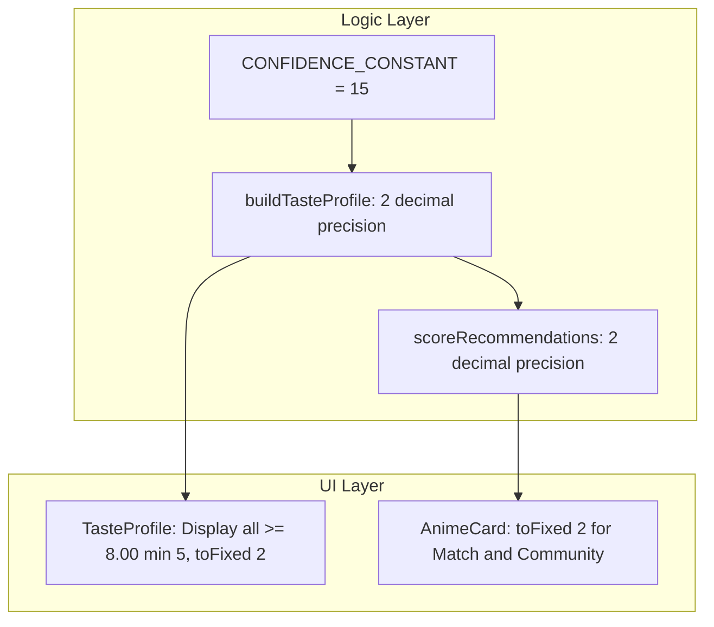

# C=15, 2 Decimal Precision & Dynamic Taste Profile Implementation Plan

> **For agentic workers:** REQUIRED SUB-SKILL: Use superpowers:subagent-driven-development to implement this plan task-by-task. Steps use checkbox (`- [ ]`) syntax for tracking.

**Goal:** Set $C=15$, display scores with 2 decimal places, and render a dynamic Taste Profile displaying all genres $\ge 8.00$ with a minimum of 5 badges.

**Architecture:** Update `CONFIDENCE_CONSTANT = 15` in `src/logic/recommender.js`, update `TasteProfile.jsx` to dynamically calculate badge limit based on $\ge 8.00$ scores with a floor of 5, and format all scores across cards and badges with `.toFixed(2)`.

**Architecture Diagram:**



**Tech Stack:** React 19, Vanilla CSS, Vitest

## Global Constraints

- $C = 15$
- Format scores with `.toFixed(2)` (ex: `8.28/10`, `8.29`)
- `TasteProfile.jsx` renders all genres with adjusted score $\ge 8.00$, with at least 5 badges shown
- Badges with score $\ge 8.00$ use `taste-badge--filled`, others (if needed to reach 5) use `taste-badge--outline`

---

### Task 1: Update `recommender.js` ($C=15$ & 2 Decimal Precision)

**Files:**
- Modify: [src/logic/recommender.js](file:///C:/Sistemas/Projetos/animes/src/logic/recommender.js)
- Modify: [src/logic/recommender.test.js](file:///C:/Sistemas/Projetos/animes/src/logic/recommender.test.js)

- [ ] **Step 1: Write failing test in `recommender.test.js` for $C=15$ and 2 decimal precision**

In [src/logic/recommender.test.js](file:///C:/Sistemas/Projetos/animes/src/logic/recommender.test.js):

```js
  it('calculates Bayesian adjustedAverage using C=15 and 2 decimal precision', () => {
    // Action: 15 entries @ 8.33 (sum 124.95). Global avg = 8.12
    // C=15 -> (15 * 8.12 + 124.95) / (15 + 15) = (121.8 + 124.95) / 30 = 246.75 / 30 = 8.225 -> 8.23
    const entries = [
      ...Array.from({ length: 15 }, () => ({ score: 8.33, media: { genres: ['Action'] } })),
      ...Array.from({ length: 114 }, () => ({ score: 8.17, media: { genres: ['Fantasy'] } })),
    ]

    const profile = buildTasteProfile(entries)

    expect(profile.get('Action').adjustedAverage).toBe(8.23)
    expect(profile.get('Fantasy').adjustedAverage).toBe(8.16)
  })
```

- [ ] **Step 2: Run test to verify failure**

```bash
npx vitest run src/logic/recommender.test.js
```

Expected: FAIL — currently uses $C=5$ and 1 decimal place.

- [ ] **Step 3: Update `recommender.js` to $C=15$ and 2 decimal precision**

In [src/logic/recommender.js](file:///C:/Sistemas/Projetos/animes/src/logic/recommender.js):

```js
const MIN_GENRE_COUNT = 2
const CONFIDENCE_CONSTANT = 15

// In buildTasteProfile:
profile.set(genre, {
  average: Math.round(realAverage * 100) / 100,
  adjustedAverage: Math.round(adjustedAverage * 100) / 100,
  count: stats.count,
  scoredCount: stats.scoredCount,
})

// In scoreRecommendations:
predictedScore = Math.round((sum / matchingGenres.length) * 100) / 100
communityScore = Math.round((media.averageScore / 10) * 100) / 100
```

- [ ] **Step 4: Update existing tests in `recommender.test.js` and run suite**

Update test assertions in [src/logic/recommender.test.js](file:///C:/Sistemas/Projetos/animes/src/logic/recommender.test.js) to match 2 decimal precision and $C=15$.

```bash
npx vitest run src/logic/recommender.test.js
```

- [ ] **Step 5: Commit**

```bash
git add src/logic/
git commit -m "feat: set CONFIDENCE_CONSTANT=15 and 2 decimal precision in recommender.js"
```

---

### Task 2: Update `TasteProfile.jsx` Dynamic Badge Rendering

**Files:**
- Modify: [src/components/TasteProfile.jsx](file:///C:/Sistemas/Projetos/animes/src/components/TasteProfile.jsx)
- Modify: [src/components/TasteProfile.test.jsx](file:///C:/Sistemas/Projetos/animes/src/components/TasteProfile.test.jsx)

- [ ] **Step 1: Update `TasteProfile.jsx` logic**

In [src/components/TasteProfile.jsx](file:///C:/Sistemas/Projetos/animes/src/components/TasteProfile.jsx):

```jsx
import './TasteProfile.css'

export default function TasteProfile({ profile = new Map() }) {
  const entries = profile?.entries ? [...profile.entries()] : []
  const sorted = entries.sort((a, b) => {
    const scoreA = a[1]?.adjustedAverage ?? a[1]?.average ?? 0
    const scoreB = b[1]?.adjustedAverage ?? b[1]?.average ?? 0
    if (scoreB !== scoreA) return scoreB - scoreA
    return (b[1]?.count ?? 0) - (a[1]?.count ?? 0)
  })

  const countAbove8 = sorted.filter(([_, stats]) => (stats?.adjustedAverage ?? stats?.average ?? 0) >= 8.00).length
  const limit = Math.max(5, countAbove8)
  const displayBadges = sorted.slice(0, limit)

  return (
    <section className="taste-profile">
      <h2 className="taste-profile__title">Seu Perfil de Gosto</h2>
      <div className="taste-profile__badges">
        {displayBadges.map(([genre, stats]) => {
          const score = stats?.adjustedAverage ?? stats?.average ?? 0
          const isFilled = score >= 8.00
          const realAvg = stats?.average ?? 0
          const count = stats?.count ?? 0

          return (
            <span
              key={genre}
              className={`taste-badge ${isFilled ? 'taste-badge--filled' : 'taste-badge--outline'}`}
            >
              {genre} ★ {realAvg.toFixed(2)} ({count})
            </span>
          )
        })}
      </div>
    </section>
  )
}
```

- [ ] **Step 2: Update unit tests in `TasteProfile.test.jsx`**

In [src/components/TasteProfile.test.jsx](file:///C:/Sistemas/Projetos/animes/src/components/TasteProfile.test.jsx):
- Test rendering when 3 genres $\ge 8.00$ -> renders 5 badges (top 3 filled, 2 outline).
- Test rendering when 7 genres $\ge 8.00$ -> renders 7 badges (all 7 filled).
- Test 2 decimal place formatting (`toFixed(2)`).

- [ ] **Step 3: Run tests**

```bash
npx vitest run src/components/TasteProfile.test.jsx
```

- [ ] **Step 4: Commit**

```bash
git add src/components/
git commit -m "feat: render dynamic TasteProfile badges (>= 8.00 min 5) with 2 decimal precision"
```

---

### Task 3: Update `AnimeCard.jsx` & Dashboard Integration Tests

**Files:**
- Modify: [src/components/AnimeCard.jsx](file:///C:/Sistemas/Projetos/animes/src/components/AnimeCard.jsx)
- Modify: [src/components/Dashboard.test.jsx](file:///C:/Sistemas/Projetos/animes/src/components/Dashboard.test.jsx)
- Modify: [src/App.test.jsx](file:///C:/Sistemas/Projetos/animes/src/App.test.jsx)

- [ ] **Step 1: Update `AnimeCard.jsx` formatting to `.toFixed(2)`**

In [src/components/AnimeCard.jsx](file:///C:/Sistemas/Projetos/animes/src/components/AnimeCard.jsx):

```jsx
<p className="anime-card__predicted">
  Match: {(anime?.predictedScore ?? 0).toFixed(2)}/10
</p>
<p className="anime-card__community">
  Comunidade: {(anime?.communityScore ?? 0).toFixed(2)}/10
</p>
```

- [ ] **Step 2: Update `Dashboard.test.jsx` & `App.test.jsx` mock numbers and assertions**

Update test assertions for `.toFixed(2)` output (e.g. `Match: 8.50/10`).

- [ ] **Step 3: Run full test suite**

```bash
npx vitest run
```

- [ ] **Step 4: Commit**

```bash
git add src/components/ src/App.test.jsx
git commit -m "feat: format AnimeCard scores with 2 decimal precision and update integration tests"
```
