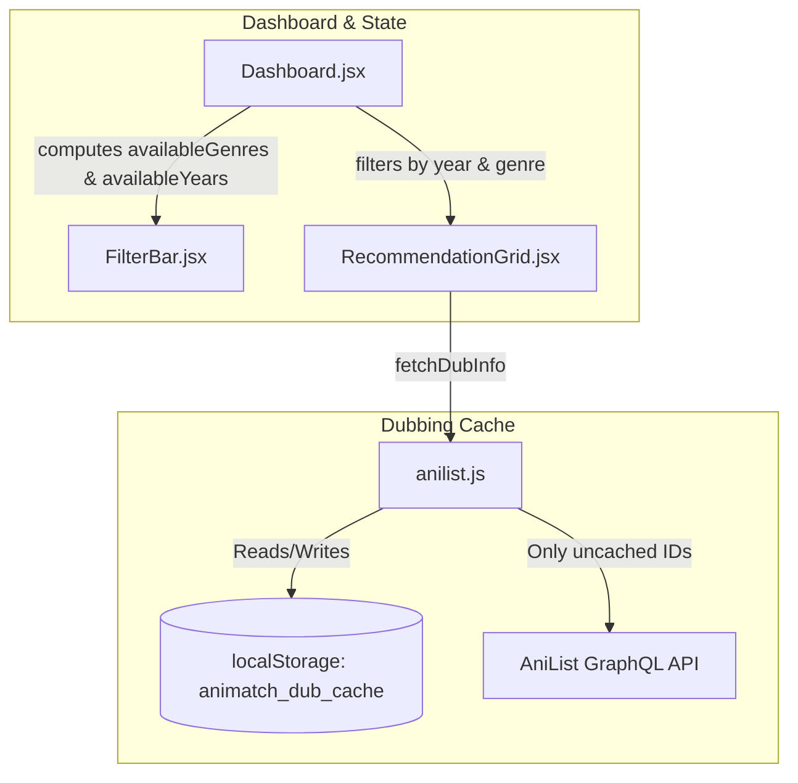

# Implementation Plan: Fase 4.2 — Gêneros Dinâmicos, Filtros de Ano e Cache de Dublagem

> **For agentic workers:** REQUIRED SUB-SKILL: Use `superpowers:subagent-driven-development` to implement this plan task-by-task. Steps use checkbox (`- [ ]`) syntax for tracking.

**Goal:** Implementar o cache de dublagem em `localStorage`, gerar a lista de gêneros dinamicamente no `FilterBar` e permitir a filtragem/ordenação por ano de lançamento.

**Architecture:** 
1. `src/api/anilist.js`: Adicionar suporte a `localStorage` em `fetchDubInfo` para armazenar mapeamentos de dublagem por 24 horas.
2. `src/components/Dashboard.jsx`: Computar `availableGenres` e `availableYears` a partir de `planningEntries` e filtrar por `selectedYear`.
3. `src/components/FilterBar.jsx`: Renderizar pílulas de gêneros e seletores de anos dinamicamente, além de opções de ordenação por ano (`year_desc` / `year_asc`).
4. `src/components/RecommendationGrid.jsx`: Suportar ordenação `year_desc` e `year_asc` com tratamento nulo.

**Architecture Diagram:**



**Tech Stack:** React, Vite, Vitest, Testing Library.

## Global Constraints

- Manter compatibilidade com os testes existentes.
- Executar `npm test` para verificação TDD a cada passo.

---

### Task 1: Add LocalStorage Caching to `fetchDubInfo` in `src/api/anilist.js`

**Files:**
- Modify: [`src/api/anilist.js`](file:///C:/Sistemas/Projetos/animes/src/api/anilist.js)
- Test: [`src/api/anilist.test.js`](file:///C:/Sistemas/Projetos/animes/src/api/anilist.test.js)

- [ ] **Step 1: Write failing unit test in `src/api/anilist.test.js`**

```javascript
it('uses dub cache from localStorage when available', async () => {
  const mockCache = {
    timestamp: Date.now(),
    dubs: { 101: true, 102: false }
  }
  localStorage.setItem('animatch_dub_cache', JSON.stringify(mockCache))

  const dubMap = await fetchDubInfo([101, 102])
  expect(dubMap.get(101)).toBe(true)
  expect(dubMap.get(102)).toBe(false)
})
```

- [ ] **Step 2: Run test to verify it fails**

Run: `npx vitest run src/api/anilist.test.js`

- [ ] **Step 3: Implement `localStorage` cache in `fetchDubInfo`**

```javascript
const CACHE_KEY_DUB = 'animatch_dub_cache'
const CACHE_DUB_TTL = 24 * 60 * 60 * 1000 // 24 horas em ms

export async function fetchDubInfo(mediaIds) {
  if (!mediaIds || mediaIds.length === 0) return new Map()

  const dubMap = new Map()
  let cachedDubs = {}

  if (typeof window !== 'undefined' && window.localStorage) {
    try {
      const cached = window.localStorage.getItem(CACHE_KEY_DUB)
      if (cached) {
        const { timestamp, dubs } = JSON.parse(cached)
        if (Date.now() - timestamp < CACHE_DUB_TTL && dubs) {
          cachedDubs = dubs
        }
      }
    } catch (e) {
      // Ignore cache read errors
    }
  }

  const missingIds = []
  for (const id of mediaIds) {
    if (id in cachedDubs) {
      dubMap.set(id, cachedDubs[id])
    } else {
      missingIds.push(id)
    }
  }

  if (missingIds.length === 0) {
    return dubMap
  }

  try {
    const data = await queryAniList(DUB_QUERY, { idIn: missingIds })
    const mediaList = data?.Page?.media ?? []

    for (const media of mediaList) {
      const chars = media?.characters?.edges ?? []
      const hasPtBr = chars.some(
        (char) => char?.voiceActors && char.voiceActors.some((va) => va?.languageV2 === 'Portuguese')
      )
      dubMap.set(media.id, hasPtBr)
      cachedDubs[media.id] = hasPtBr
    }

    if (typeof window !== 'undefined' && window.localStorage) {
      try {
        window.localStorage.setItem(
          CACHE_KEY_DUB,
          JSON.stringify({
            timestamp: Date.now(),
            dubs: cachedDubs,
          })
        )
      } catch (e) {
        // Ignore cache write errors
      }
    }
  } catch (err) {
    console.error('Failed to fetch dub info', err)
  }

  return dubMap
}
```

- [ ] **Step 4: Run test to verify it passes**

Run: `npx vitest run src/api/anilist.test.js`

- [ ] **Step 5: Commit**

```bash
git add src/api/anilist.js src/api/anilist.test.js
git commit -m "feat(api): add localStorage cache with 24h TTL for dubbing info"
```

---

### Task 2: Implement Dynamic Genres and Year Selector in `FilterBar.jsx`

**Files:**
- Modify: [`src/components/FilterBar.jsx`](file:///C:/Sistemas/Projetos/animes/src/components/FilterBar.jsx)
- Modify: [`src/components/FilterBar.test.jsx`](file:///C:/Sistemas/Projetos/animes/src/components/FilterBar.test.jsx)

- [ ] **Step 1: Write test for dynamic genres and year selector in `FilterBar.test.jsx`**

- [ ] **Step 2: Update `FilterBar.jsx` to accept `availableGenres`, `availableYears`, `selectedYear`, `onSelectYear`**

```jsx
const DEFAULT_MAIN_GENRES = [
  { id: 'ALL', label: 'Todos os Gêneros' },
  { id: 'Action', label: 'Ação' },
  { id: 'Adventure', label: 'Aventura' },
  { id: 'Comedy', label: 'Comédia' },
  { id: 'Drama', label: 'Drama' },
  { id: 'Fantasy', label: 'Fantasia' },
  { id: 'Romance', label: 'Romance' },
  { id: 'Sci-Fi', label: 'Ficção' },
  { id: 'Slice of Life', label: 'Slice of Life' },
]

const SORT_OPTIONS = [
  { id: 'predicted', label: 'Predicted Score' },
  { id: 'community', label: 'Nota Comunitária' },
  { id: 'year_desc', label: 'Ano (Mais Recente)' },
  { id: 'year_asc', label: 'Ano (Mais Antigo)' },
  { id: 'title', label: 'Título (A-Z)' },
]
```

Renderizar pílulas de gêneros customizados se `availableGenres` for fornecido, e o `<select>` de Anos se `availableYears` for fornecido.

- [ ] **Step 3: Run Vitest to verify all tests pass**

Run: `npx vitest run src/components/FilterBar.test.jsx`

- [ ] **Step 4: Commit**

```bash
git add src/components/FilterBar.jsx src/components/FilterBar.test.jsx
git commit -m "feat(filter): support dynamic genres and year filtering in FilterBar"
```

---

### Task 3: Integrate Year Filtering and Dynamic Computation in `Dashboard.jsx` & `RecommendationGrid.jsx`

**Files:**
- Modify: [`src/components/Dashboard.jsx`](file:///C:/Sistemas/Projetos/animes/src/components/Dashboard.jsx)
- Modify: [`src/components/RecommendationGrid.jsx`](file:///C:/Sistemas/Projetos/animes/src/components/RecommendationGrid.jsx)
- Test: [`src/components/Dashboard.test.jsx`](file:///C:/Sistemas/Projetos/animes/src/components/Dashboard.test.jsx)

- [ ] **Step 1: Compute `availableGenres` and `availableYears` in `Dashboard.jsx`**

```jsx
  const availableGenres = useMemo(() => {
    const genresSet = new Set()
    for (const entry of planningEntries) {
      for (const g of entry.media?.genres ?? []) {
        genresSet.add(g)
      }
    }
    return Array.from(genresSet).sort()
  }, [planningEntries])

  const availableYears = useMemo(() => {
    const yearsSet = new Set()
    for (const entry of planningEntries) {
      const year = entry.media?.seasonYear || entry.media?.startDate?.year
      if (year) yearsSet.add(year)
    }
    return Array.from(yearsSet).sort((a, b) => b - a)
  }, [planningEntries])
```

- [ ] **Step 2: Add `selectedYear` state and year sorting logic in `Dashboard.jsx` and `RecommendationGrid.jsx`**

Tratar ordenação por ano (`year_desc` / `year_asc`):
```javascript
if (sortBy === 'year_desc') {
  const yearA = a.year || a.seasonYear || a.startDate?.year || 0
  const yearB = b.year || b.seasonYear || b.startDate?.year || 0
  if (yearB !== yearA) return yearB - yearA
  return (b.predictedScore || 0) - (a.predictedScore || 0)
}
if (sortBy === 'year_asc') {
  const yearA = a.year || a.seasonYear || a.startDate?.year || Infinity
  const yearB = b.year || b.seasonYear || b.startDate?.year || Infinity
  if (yearA !== yearB) return yearA - yearB
  return (b.predictedScore || 0) - (a.predictedScore || 0)
}
```

- [ ] **Step 3: Run full test suite**

Run: `npm test`

- [ ] **Step 4: Commit**

```bash
git add src/components/Dashboard.jsx src/components/RecommendationGrid.jsx src/components/Dashboard.test.jsx
git commit -m "feat(dashboard): integrate dynamic genres, year filter and year sorting"
```
