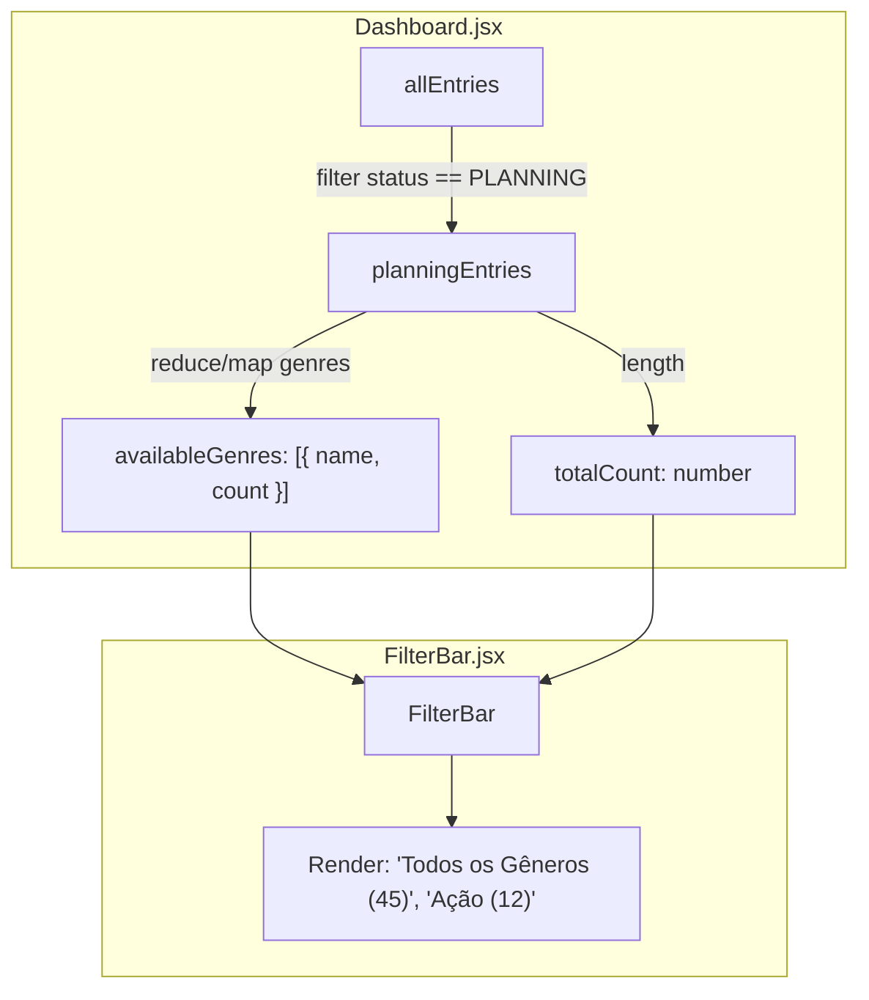

# FilterBar Genre Source & Item Counters Implementation Plan

> **For agentic workers:** REQUIRED SUB-SKILL: Use superpowers:subagent-driven-development to implement this plan task-by-task. Steps use checkbox (`- [ ]`) syntax for tracking.

**Goal:** Exibir a contagem total de itens planejados ao lado do rótulo de cada gênero na FilterBar (ex: "Ação (12)", "Todos os Gêneros (45)").

**Architecture:** O `Dashboard.jsx` irá agrupar as entradas com status `PLANNING` por gênero, calculando o total para cada gênero e para o conjunto completo ("ALL"). A `FilterBar.jsx` renderizará os botões com o formato `<rótulo> (<quantidade>)`, suportando tanto o novo formato de dados `{ name, count }` quanto arrays simples de strings para retrocompatibilidade.

**Architecture Diagram:**



**Tech Stack:** React, Vitest, Testing Library (@testing-library/react)

## Global Constraints

- Manter retrocompatibilidade se `availableGenres` for informado como um array de strings.
- Manter a contagem dos botões estável (refletindo sempre o total bruto da lista de Planejados).

---

### Task 1: Atualizar o cálculo de gêneros com contagem no Dashboard

**Files:**
- Modify: `src/components/Dashboard.jsx`
- Test: `src/components/Dashboard.test.jsx`

**Interfaces:**
- Consumes: `allEntries` (Array of anime entry objects)
- Produces: `availableGenres` (Array of `{ name: string, count: number }` passed to `<FilterBar />`)

- [ ] **Step 1: Write the failing test**

Editar `src/components/Dashboard.test.jsx` para checar se a `FilterBar` recebe e renderiza gêneros com contagem.

```javascript
test('renders filter bar genres with planning counts', () => {
  const mockEntries = [
    { id: 1, status: 'PLANNING', media: { id: 1, title: { romaji: 'Anime 1' }, genres: ['Action', 'Comedy'] } },
    { id: 2, status: 'PLANNING', media: { id: 2, title: { romaji: 'Anime 2' }, genres: ['Action'] } },
    { id: 3, status: 'COMPLETED', media: { id: 3, title: { romaji: 'Anime 3' }, genres: ['Drama'] } },
  ]

  render(<Dashboard allEntries={mockEntries} username="testuser" />)

  expect(screen.getByRole('button', { name: /Todos os Gêneros \(2\)/i })).toBeInTheDocument()
  expect(screen.getByRole('button', { name: /Action \(2\)/i })).toBeInTheDocument()
  expect(screen.getByRole('button', { name: /Comedy \(1\)/i })).toBeInTheDocument()
  expect(screen.queryByRole('button', { name: /Drama/i })).not.toBeInTheDocument()
})
```

- [ ] **Step 2: Run test to verify it fails**

Run: `npx vitest run src/components/Dashboard.test.jsx`
Expected: FAIL (button with name `Todos os Gêneros (2)` not found)

- [ ] **Step 3: Update Dashboard.jsx to compute availableGenres as objects with count**

Atualizar o memo `availableGenres` em `src/components/Dashboard.jsx`:

```javascript
  const availableGenres = useMemo(() => {
    const genreCounts = new Map()
    for (const entry of planningEntries) {
      const genres = entry.genres || entry.media?.genres || []
      for (const genre of genres) {
        if (genre) {
          genreCounts.set(genre, (genreCounts.get(genre) || 0) + 1)
        }
      }
    }
    return Array.from(genreCounts.entries())
      .map(([name, count]) => ({ name, count }))
      .sort((a, b) => a.name.localeCompare(b.name))
  }, [planningEntries])
```

E também passar `totalPlanningCount={planningEntries.length}` para `<FilterBar />`:

```javascript
  <FilterBar
    selectedGenre={selectedFilterGenre}
    onSelectGenre={setSelectedFilterGenre}
    availableGenres={availableGenres}
    totalPlanningCount={planningEntries.length}
    ...
  />
```

- [ ] **Step 4: Run test to verify status**

Run: `npx vitest run src/components/Dashboard.test.jsx`

- [ ] **Step 5: Commit**

```bash
git add src/components/Dashboard.jsx src/components/Dashboard.test.jsx
git commit -m "feat: compute planning genre counts in Dashboard"
```

---

### Task 2: Atualizar a FilterBar para exibir os contadores de itens por gênero

**Files:**
- Modify: `src/components/FilterBar.jsx`
- Test: `src/components/FilterBar.test.jsx`

**Interfaces:**
- Consumes: `availableGenres` (`{ name: string, count: number }[]` or `string[]`), `totalPlanningCount` (`number`)
- Produces: Botões de filtro renderizados no DOM com rótulos `Nome (Contagem)`

- [ ] **Step 1: Write the failing test**

Editar `src/components/FilterBar.test.jsx` para verificar a renderização de objetos com `{ name, count }` e `totalPlanningCount`.

```javascript
test('renders genre buttons with counts when provided as objects', () => {
  const genres = [
    { name: 'Action', count: 5 },
    { name: 'Comedy', count: 3 },
  ]

  render(
    <FilterBar
      availableGenres={genres}
      totalPlanningCount={8}
      selectedGenre="ALL"
      onSelectGenre={() => {}}
    />
  )

  expect(screen.getByRole('button', { name: 'Todos os Gêneros (8)' })).toBeInTheDocument()
  expect(screen.getByRole('button', { name: 'Action (5)' })).toBeInTheDocument()
  expect(screen.getByRole('button', { name: 'Comedy (3)' })).toBeInTheDocument()
})
```

- [ ] **Step 2: Run test to verify it fails**

Run: `npx vitest run src/components/FilterBar.test.jsx`
Expected: FAIL (button text mismatch or missing count)

- [ ] **Step 3: Update FilterBar.jsx implementation**

Modificar `src/components/FilterBar.jsx` para processar a prop `availableGenres` e `totalPlanningCount`:

```javascript
export default function FilterBar({
  selectedGenre = 'ALL',
  onSelectGenre,
  availableGenres,
  totalPlanningCount,
  ...
}) {
  const genresToRender = useMemo(() => {
    if (!availableGenres || availableGenres.length === 0) {
      return DEFAULT_MAIN_GENRES
    }

    const allLabel = totalPlanningCount != null 
      ? `Todos os Gêneros (${totalPlanningCount})`
      : 'Todos os Gêneros'

    const genreItems = availableGenres.map((g) => {
      if (typeof g === 'object' && g !== null) {
        return { id: g.name, label: `${g.name} (${g.count})` }
      }
      return { id: g, label: g }
    })

    return [{ id: 'ALL', label: allLabel }, ...genreItems]
  }, [availableGenres, totalPlanningCount])
```

- [ ] **Step 4: Run all tests to verify passing state**

Run: `npx vitest run`
Expected: PASS (All tests pass)

- [ ] **Step 5: Commit**

```bash
git add src/components/FilterBar.jsx src/components/FilterBar.test.jsx
git commit -m "feat: display item counts on FilterBar genre buttons"
```
