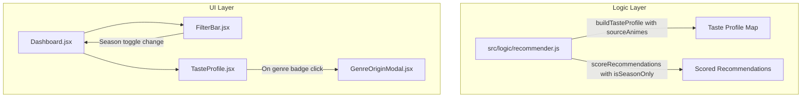

# Seasonal Anime Filter & Taste Profile Origin Breakdown Implementation Plan

> **For agentic workers:** REQUIRED SUB-SKILL: Use superpowers:subagent-driven-development to implement this plan task-by-task. Steps use checkbox (`- [ ]`) syntax for tracking.

**Goal:** Implement a seasonal anime filter for recommendations and a breakdown modal showing which completed/scored animes contributed to each genre in the Taste Profile.

**Architecture:**
1. Extend `buildTasteProfile` in `src/logic/recommender.js` to attach an array of `sourceAnimes` to each genre in the returned Map.
2. Create `GenreOriginModal` component in `src/components/GenreOriginModal.jsx` (with corresponding CSS and tests) to show contributing animes when a user clicks on a genre badge.
3. Update `FilterBar.jsx` and `Dashboard.jsx` to include a "Temporada Atual" toggle that filters recommendations to current season items.

**Architecture Diagram:**



**Tech Stack:** React, Vitest, JavaScript (ES Modules), CSS.

## Global Constraints

- Use Vanilla CSS for styling (matching existing UI style in components).
- TDD required: write failing test, verify failure, implement minimal code, verify pass, commit.
- Preserve API interfaces and signatures.

---

### Task 1: Update `buildTasteProfile` to include `sourceAnimes`

**Files:**
- Modify: `src/logic/recommender.js:17-67`
- Test: `src/logic/recommender.test.js`

**Interfaces:**
- Consumes: `completedEntries` Array
- Produces: `profile` Map where each genre stats object contains `sourceAnimes: Array<{ id, title, score, coverImage, status }>`

- [ ] **Step 1: Write the failing test**

Edit `src/logic/recommender.test.js` to add a test for `sourceAnimes` in `buildTasteProfile`:

```javascript
test('buildTasteProfile includes sourceAnimes for each genre', () => {
  const mockCompleted = [
    {
      score: 9,
      status: 'COMPLETED',
      media: {
        id: 101,
        title: { english: 'Anime A', romaji: 'Anime A' },
        genres: ['Action', 'Drama'],
        coverImage: { large: 'http://img.com/a.jpg' }
      }
    },
    {
      score: 8,
      status: 'COMPLETED',
      media: {
        id: 102,
        title: { english: 'Anime B', romaji: 'Anime B' },
        genres: ['Action'],
        coverImage: { large: 'http://img.com/b.jpg' }
      }
    }
  ]

  const profile = buildTasteProfile(mockCompleted)
  const actionStats = profile.get('Action')

  expect(actionStats).toBeDefined()
  expect(actionStats.sourceAnimes).toHaveLength(2)
  expect(actionStats.sourceAnimes[0]).toEqual({
    id: 101,
    title: 'Anime A',
    score: 9,
    coverImage: 'http://img.com/a.jpg',
    status: 'COMPLETED'
  })
})
```

- [ ] **Step 2: Run test to verify it fails**

Run: `npx vitest run src/logic/recommender.test.js`
Expected: FAIL with `sourceAnimes` undefined.

- [ ] **Step 3: Write minimal implementation**

Update `buildTasteProfile` in `src/logic/recommender.js`:

```javascript
export function buildTasteProfile(completedEntries = []) {
  const genreStats = new Map()
  let globalTotal = 0
  let globalScoredCount = 0

  for (const entry of completedEntries) {
    if (!entry?.media) continue
    const genres = entry.media.genres ?? []
    const score = entry.score ?? 0

    if (score > 0) {
      globalTotal += score
      globalScoredCount += 1
    }

    const animeInfo = {
      id: entry.media.id,
      title: entry.media.title?.english || entry.media.title?.romaji || 'Untitled',
      score: score,
      coverImage: entry.media.coverImage?.large ?? '',
      status: entry.status || 'COMPLETED',
    }

    for (const genre of genres) {
      if (!genreStats.has(genre)) {
        genreStats.set(genre, { total: 0, count: 0, scoredCount: 0, sourceAnimes: [] })
      }
      const stats = genreStats.get(genre)
      stats.count += 1
      stats.sourceAnimes.push(animeInfo)

      if (score > 0) {
        stats.total += score
        stats.scoredCount += 1
      }
    }
  }

  const userGlobalAverage = globalScoredCount > 0 ? globalTotal / globalScoredCount : 7.0

  const profile = new Map()

  for (const [genre, stats] of genreStats) {
    if (stats.scoredCount >= MIN_GENRE_COUNT) {
      const realAverage = stats.total / stats.scoredCount
      const adjustedAverage =
        (CONFIDENCE_CONSTANT * userGlobalAverage + stats.total) /
        (CONFIDENCE_CONSTANT + stats.scoredCount)

      profile.set(genre, {
        average: Math.round(realAverage * 100) / 100,
        adjustedAverage: Math.round(adjustedAverage * 100) / 100,
        count: stats.count,
        scoredCount: stats.scoredCount,
        sourceAnimes: stats.sourceAnimes,
      })
    }
  }

  return profile
}
```

- [ ] **Step 4: Run test to verify it passes**

Run: `npx vitest run src/logic/recommender.test.js`
Expected: PASS

- [ ] **Step 5: Commit**

```bash
git add src/logic/recommender.js src/logic/recommender.test.js
git commit -m "feat: include sourceAnimes in taste profile logic"
```

---

### Task 2: Create `GenreOriginModal` Component & Integrate with `TasteProfile`

**Files:**
- Create: `src/components/GenreOriginModal.jsx`
- Create: `src/components/GenreOriginModal.css`
- Create: `src/components/GenreOriginModal.test.jsx`
- Modify: `src/components/TasteProfile.jsx`
- Modify: `src/components/TasteProfile.test.jsx`

**Interfaces:**
- `GenreOriginModal`: props `{ genre, stats, onClose, onFilterGenre }`
- `TasteProfile`: props `{ profile, onGenreClick }`

- [ ] **Step 1: Write failing component tests**

Create `src/components/GenreOriginModal.test.jsx`:

```jsx
import { render, screen, fireEvent } from '@testing-library/react'
import { describe, test, expect, vi } from 'vitest'
import GenreOriginModal from './GenreOriginModal'

describe('GenreOriginModal', () => {
  const mockStats = {
    average: 8.5,
    adjustedAverage: 8.2,
    count: 2,
    sourceAnimes: [
      { id: 1, title: 'Attack on Titan', score: 9, coverImage: 'titan.jpg', status: 'COMPLETED' },
      { id: 2, title: 'Demon Slayer', score: 8, coverImage: 'slayer.jpg', status: 'COMPLETED' }
    ]
  }

  test('renders genre details and source animes', () => {
    render(<GenreOriginModal genre="Action" stats={mockStats} onClose={vi.fn()} onFilterGenre={vi.fn()} />)

    expect(screen.getByText(/Origem da nota: Action/i)).toBeInTheDocument()
    expect(screen.getByText(/Attack on Titan/i)).toBeInTheDocument()
    expect(screen.getByText(/Demon Slayer/i)).toBeInTheDocument()
  })

  test('calls onClose when close button clicked', () => {
    const handleClose = vi.fn()
    render(<GenreOriginModal genre="Action" stats={mockStats} onClose={handleClose} onFilterGenre={vi.fn()} />)

    fireEvent.click(screen.getByRole('button', { name: /fechar/i }))
    expect(handleClose).toHaveBeenCalledTimes(1)
  })
})
```

- [ ] **Step 2: Run test to verify it fails**

Run: `npx vitest run src/components/GenreOriginModal.test.jsx`
Expected: FAIL (component not created)

- [ ] **Step 3: Implement `GenreOriginModal.jsx` and CSS**

Create `src/components/GenreOriginModal.jsx`:

```jsx
import './GenreOriginModal.css'

export default function GenreOriginModal({ genre, stats, onClose, onFilterGenre }) {
  if (!genre || !stats) return null

  const sourceAnimes = stats.sourceAnimes || []

  return (
    <div className="modal-overlay" onClick={onClose}>
      <div className="genre-origin-modal" onClick={(e) => e.stopPropagation()}>
        <div className="genre-origin-modal__header">
          <h2>Origem da nota: {genre}</h2>
          <button className="genre-origin-modal__close-btn" onClick={onClose} aria-label="Fechar">
            &times;
          </button>
        </div>

        <div className="genre-origin-modal__summary">
          <p>Média Real: <strong>★ {stats.average?.toFixed(2)}</strong></p>
          <p>Animes avaliados: <strong>{stats.scoredCount || sourceAnimes.length}</strong></p>
        </div>

        <div className="genre-origin-modal__list">
          {sourceAnimes.map((anime) => (
            <div key={anime.id} className="genre-origin-card">
              {anime.coverImage && (
                
              )}
              <div className="genre-origin-card__info">
                <span className="genre-origin-card__title">{anime.title}</span>
                <span className="genre-origin-card__score">Sua Nota: ★ {anime.score || 'N/A'}</span>
              </div>
            </div>
          ))}
        </div>

        <div className="genre-origin-modal__actions">
          {onFilterGenre && (
            <button
              className="genre-origin-modal__filter-btn"
              onClick={() => {
                onFilterGenre(genre)
                onClose()
              }}
            >
              Filtrar recomendações por {genre}
            </button>
          )}
        </div>
      </div>
    </div>
  )
}
```

Create `src/components/GenreOriginModal.css`:

```css
.genre-origin-modal {
  background: var(--bg-card, #1e1e24);
  color: var(--text-color, #fff);
  border-radius: 12px;
  padding: 1.5rem;
  max-width: 550px;
  width: 90%;
  max-height: 80vh;
  display: flex;
  flex-direction: column;
  box-shadow: 0 8px 32px rgba(0, 0, 0, 0.4);
}

.genre-origin-modal__header {
  display: flex;
  justify-content: space-between;
  align-items: center;
  border-bottom: 1px solid var(--border-color, #333);
  padding-bottom: 0.75rem;
  margin-bottom: 1rem;
}

.genre-origin-modal__close-btn {
  background: transparent;
  border: none;
  font-size: 1.5rem;
  color: var(--text-muted, #aaa);
  cursor: pointer;
}

.genre-origin-modal__summary {
  display: flex;
  gap: 1.5rem;
  margin-bottom: 1rem;
  font-size: 0.95rem;
  color: var(--text-secondary, #ccc);
}

.genre-origin-modal__list {
  overflow-y: auto;
  display: flex;
  flex-direction: column;
  gap: 0.75rem;
  margin-bottom: 1rem;
  padding-right: 0.5rem;
}

.genre-origin-card {
  display: flex;
  align-items: center;
  gap: 1rem;
  background: rgba(255, 255, 255, 0.05);
  padding: 0.5rem 0.75rem;
  border-radius: 8px;
}

.genre-origin-card__cover {
  width: 45px;
  height: 60px;
  object-fit: cover;
  border-radius: 4px;
}

.genre-origin-card__info {
  display: flex;
  flex-direction: column;
  gap: 0.25rem;
}

.genre-origin-card__title {
  font-weight: 600;
  font-size: 0.95rem;
}

.genre-origin-card__score {
  font-size: 0.85rem;
  color: #f39c12;
}

.genre-origin-modal__actions {
  display: flex;
  justify-content: flex-end;
  border-top: 1px solid var(--border-color, #333);
  padding-top: 0.75rem;
}

.genre-origin-modal__filter-btn {
  background: var(--accent-color, #ff4757);
  color: white;
  border: none;
  padding: 0.5rem 1rem;
  border-radius: 6px;
  cursor: pointer;
  font-weight: 600;
}
```

Update `TasteProfile.jsx` to maintain modal state:

```jsx
import { useState } from 'react'
import GenreOriginModal from './GenreOriginModal'
import './TasteProfile.css'

export default function TasteProfile({ profile = new Map(), onGenreClick }) {
  const [selectedModalGenre, setSelectedModalGenre] = useState(null)

  const entries = profile?.entries ? [...profile.entries()] : []
  const sorted = entries.sort((a, b) => {
    const scoreA = a[1]?.adjustedAverage ?? a[1]?.average ?? 0
    const scoreB = b[1]?.adjustedAverage ?? b[1]?.average ?? 0
    if (scoreB !== scoreA) return scoreB - scoreA
    return (b[1]?.count ?? 0) - (a[1]?.count ?? 0)
  })

  const countAbove8 = sorted.filter(([_, stats]) => (stats?.adjustedAverage ?? stats?.average ?? 0) >= 8.00).length
  const limit = Math.min(10, Math.max(5, countAbove8))
  const displayBadges = sorted.slice(0, limit)

  return (
    <section className="taste-profile">
      <h2 className="taste-profile__title">Seu Perfil de Gosto</h2>
      <div className="taste-profile__badges">
        {displayBadges.map(([genre, stats]) => {
          const score = stats?.adjustedAverage ?? stats?.average ?? 0
          const isFilled = score >= 8.00
          const realAvg = stats?.average ?? 0
          const count = stats?.count ?? 0

          return (
            <span
              key={genre}
              className={`taste-badge ${isFilled ? 'taste-badge--filled' : 'taste-badge--outline'}`}
              onClick={() => setSelectedModalGenre({ genre, stats })}
              style={{ cursor: 'pointer' }}
            >
              {genre} ★ {realAvg.toFixed(2)} ({count})
            </span>
          )
        })}
      </div>

      {selectedModalGenre && (
        <GenreOriginModal
          genre={selectedModalGenre.genre}
          stats={selectedModalGenre.stats}
          onClose={() => setSelectedModalGenre(null)}
          onFilterGenre={onGenreClick}
        />
      )}
    </section>
  )
}
```

- [ ] **Step 4: Run component tests to verify pass**

Run: `npx vitest run src/components/GenreOriginModal.test.jsx src/components/TasteProfile.test.jsx`
Expected: PASS

- [ ] **Step 5: Commit**

```bash
git add src/components/GenreOriginModal.jsx src/components/GenreOriginModal.css src/components/GenreOriginModal.test.jsx src/components/TasteProfile.jsx
git commit -m "feat: add GenreOriginModal and integrate into TasteProfile"
```

---

### Task 3: Seasonal Filter in `FilterBar` & `Dashboard`

**Files:**
- Modify: `src/components/FilterBar.jsx`
- Modify: `src/components/FilterBar.test.jsx`
- Modify: `src/components/Dashboard.jsx`
- Modify: `src/components/Dashboard.test.jsx`

**Interfaces:**
- `FilterBar`: props include `isSeasonOnly`, `onSeasonOnlyChange`
- Seasonal Logic helper: checks if `year === currentYear` or `status === 'RELEASING'`

- [ ] **Step 1: Write failing filter test**

Edit `src/components/FilterBar.test.jsx` to test season checkbox/button:

```jsx
test('calls onSeasonOnlyChange when season toggle is clicked', () => {
  const handleSeasonChange = vi.fn()
  render(
    <FilterBar
      selectedGenre="ALL"
      onGenreChange={vi.fn()}
      genres={['Action']}
      isSeasonOnly={false}
      onSeasonOnlyChange={handleSeasonChange}
    />
  )

  const seasonToggle = screen.getByLabelText(/Apenas da Temporada/i)
  fireEvent.click(seasonToggle)
  expect(handleSeasonChange).toHaveBeenCalledWith(true)
})
```

- [ ] **Step 2: Run test to verify it fails**

Run: `npx vitest run src/components/FilterBar.test.jsx`
Expected: FAIL (element not found)

- [ ] **Step 3: Implement Season Toggle in `FilterBar.jsx`**

Update `src/components/FilterBar.jsx`:

```jsx
import './FilterBar.css'

export default function FilterBar({
  selectedGenre = 'ALL',
  onGenreChange,
  genres = [],
  isSeasonOnly = false,
  onSeasonOnlyChange,
}) {
  return (
    <div className="filter-bar">
      <div className="filter-bar__group">
        <label htmlFor="genre-select" className="filter-bar__label">Gênero:</label>
        <select
          id="genre-select"
          className="filter-bar__select"
          value={selectedGenre}
          onChange={(e) => onGenreChange?.(e.target.value)}
        >
          <option value="ALL">Todos os Gêneros</option>
          {genres.map((genre) => (
            <option key={genre} value={genre}>
              {genre}
            </option>
          ))}
        </select>
      </div>

      <div className="filter-bar__group filter-bar__checkbox-group">
        <label className="filter-bar__checkbox-label">
          <input
            type="checkbox"
            checked={isSeasonOnly}
            onChange={(e) => onSeasonOnlyChange?.(e.target.checked)}
            className="filter-bar__checkbox"
          />
          Apenas da Temporada
        </label>
      </div>
    </div>
  )
}
```

Update `src/components/Dashboard.jsx` to state-manage `isSeasonOnly` and filter recommendations:

```javascript
// In Dashboard.jsx state declarations:
const [isSeasonOnly, setIsSeasonOnly] = useState(false)
const currentYear = new Date().getFullYear()

// In recommendations calculation:
const recommendations = useMemo(() => {
  const scored = scoreRecommendations(planningEntries, tasteProfile, selectedGenre)
  if (!isSeasonOnly) return scored

  return scored.filter((rec) => {
    const isCurrentYear = rec.year === currentYear
    const isReleasing = rec.status === 'RELEASING'
    return isCurrentYear || isReleasing
  })
}, [planningEntries, tasteProfile, selectedGenre, isSeasonOnly, currentYear])
```

- [ ] **Step 4: Run all test suites to verify pass**

Run: `npx vitest run`
Expected: ALL PASS

- [ ] **Step 5: Commit**

```bash
git add src/components/FilterBar.jsx src/components/FilterBar.test.jsx src/components/Dashboard.jsx src/components/Dashboard.test.jsx
git commit -m "feat: add current season anime filter to recommendations"
```
