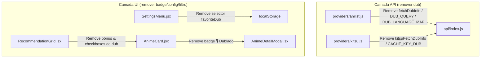

# [Remover Dublagem] Implementation Plan

> **For agentic workers:** REQUIRED SUB-SKILL: Use superpowers:subagent-driven-development to implement this plan task-by-task. Steps use checkbox (`- [ ]`) syntax for tracking.

**Goal:** Remover completamente a funcionalidade de detecção de dublagem, selo/badge de dublagem, configurações de dublagem favorita e bônus/filtros associados de todo o aplicativo.

**Architecture:** Limpeza cirúrgica em camadas: providers de API (AniList e Kitsu), camada de abstração de API (`api/index.js`), componentes UI (`AnimeCard`, `AnimeDetailModal`, `SettingsMenu`, `RecommendationGrid`, `Dashboard`), arquivos de localização (i18n), documentação (`README.md`, `roadmap.md`) e seus respetivos testes.

**Architecture Diagram:**



**Tech Stack:** React, Vitest, React Testing Library, i18next.

## Global Constraints

- Manter a integridade de todas as outras funcionalidades de recomendação, filtros por gênero/ano, e estatísticas.
- Manter a suíte de testes 100% verde sem regressões.

---

### Task 1: Remover dublagem dos Providers de API e exportações de API

**Files:**
- Modify: `src/api/providers/anilist.js`
- Modify: `src/api/providers/kitsu.js`
- Modify: `src/api/index.js`
- Test: `src/api/providers/anilist.test.js`
- Test: `src/api/providers/kitsu.test.js`
- Test: `src/api/index.test.js`

- [ ] **Step 1: Remover funções de dublagem em `src/api/providers/anilist.js`**
Remover `CACHE_KEY_DUB`, `CACHE_DUB_TTL`, `DUB_LANGUAGE_MAP`, `DUB_QUERY` e `fetchDubInfo`.

- [ ] **Step 2: Remover funções de dublagem em `src/api/providers/kitsu.js`**
Remover `KITSU_CACHE_KEY_DUB`, `kitsuFetchDubInfo` e a limpeza de cache de dub em `clearKitsuCache`.

- [ ] **Step 3: Remover exportações e wrappers de dublagem em `src/api/index.js`**
Remover `anilistFetchDub`, `kitsuFetchDubInfo`, `fetchDubInfo`, `DUB_LANGUAGE_MAP` e a remoção de `CACHE_KEY_DUB` / `KITSU_CACHE_KEY_DUB` em `clearProviderCache`.

- [ ] **Step 4: Atualizar testes dos providers**
Remover testes de `fetchDubInfo` / `kitsuFetchDubInfo` e mocks de dublagem em `anilist.test.js`, `kitsu.test.js` e `index.test.js`.

- [ ] **Step 5: Executar testes de API**
Run: `npx vitest run src/api/`
Expected: PASS

- [ ] **Step 6: Commit**
```bash
git add src/api/
git commit -m "refactor(api): remove dubbing detection and cache logic"
```

---

### Task 2: Remover dublagem dos Componentes UI e Hooks/Estado

**Files:**
- Modify: `src/components/AnimeCard.jsx`
- Modify: `src/components/AnimeDetailModal.jsx`
- Modify: `src/components/SettingsMenu.jsx`
- Modify: `src/components/RecommendationGrid.jsx`
- Modify: `src/components/Dashboard.jsx`
- Test: `src/components/AnimeCard.test.jsx`
- Test: `src/components/SettingsMenu.test.jsx`
- Test: `src/components/RecommendationGrid.test.jsx`
- Test: `src/App.test.jsx`

- [ ] **Step 1: Remover prop e badge de dublagem em `src/components/AnimeCard.jsx`**
Remover `hasDub`, `dubLanguage` das props e a renderização da badge `🎙️ Dublado`.

- [ ] **Step 2: Remover menções/props de dublagem em `src/components/AnimeDetailModal.jsx`**
Limpar props ou menções a dublagem (se houver).

- [ ] **Step 3: Remover seletor de dublagem favorita em `src/components/SettingsMenu.jsx`**
Remover estado/prop `favoriteDub`, `setFavoriteDub`, o `<select>` de dublagem favorita e a persistência dessa chave no localStorage.

- [ ] **Step 4: Remover bônus de pontuação, filtros e chamadas de dub em `src/components/RecommendationGrid.jsx`**
Remover chamada a `fetchDubInfo`, estados `favoriteDub`, `ignoreDub`, `onlyFavoriteDub`, checkboxes de filtro de dublagem e o bônus de +0.1 / +0.15 no algoritmo de recomendação.

- [ ] **Step 5: Remover passagem de estado de dub em `src/components/Dashboard.jsx` e `src/App.jsx`**
Remover o estado `favoriteDub` (ou `localStorage.getItem('animatch_favorite_dub')`) de `App.jsx`/`Dashboard.jsx` e a passagem desse prop para `RecommendationGrid` e `SettingsMenu`.

- [ ] **Step 6: Atualizar/limpar testes de UI**
Atualizar `AnimeCard.test.jsx`, `SettingsMenu.test.jsx`, `RecommendationGrid.test.jsx` e `App.test.jsx` removendo testes ou mocks relacionados a `hasDub`, `favoriteDub` e `fetchDubInfo`.

- [ ] **Step 7: Executar todos os testes de UI**
Run: `npm test`
Expected: PASS

- [ ] **Step 8: Commit**
```bash
git add src/components/ src/App.jsx src/App.test.jsx
git commit -m "refactor(ui): remove dubbing preferences, badges, and filters"
```

---

### Task 3: Remover chaves de tradução (i18n) e atualizar Documentação

**Files:**
- Modify: `src/locales/pt-BR.json`
- Modify: `src/locales/en.json`
- Modify: `src/locales/ja.json`
- Modify: `README.md`
- Modify: `docs/roadmap.md`

- [ ] **Step 1: Remover chaves relativas a dub nos arquivos de i18n**
Remover `settings.favoriteDub`, seções `"dub": { ... }`, `labels.dubbed`, `recommendationGrid.ignoreDub`, `recommendationGrid.onlyFavoriteDub` de `pt-BR.json`, `en.json` e `ja.json`.

- [ ] **Step 2: Atualizar README.md**
Remover a menção a Dublagem / Dubladores no `README.md`.

- [ ] **Step 3: Atualizar docs/roadmap.md**
Marcar `[x] ⚠️ **Remover feature de Dublagem**` no checklist do `docs/roadmap.md`.

- [ ] **Step 4: Rodar suíte completa de verificação**
Run: `npm test`
Expected: PASS

- [ ] **Step 5: Commit final**
```bash
git add src/locales/ README.md docs/roadmap.md
git commit -m "docs & i18n: remove dubbing locale keys and update roadmap/README"
```
