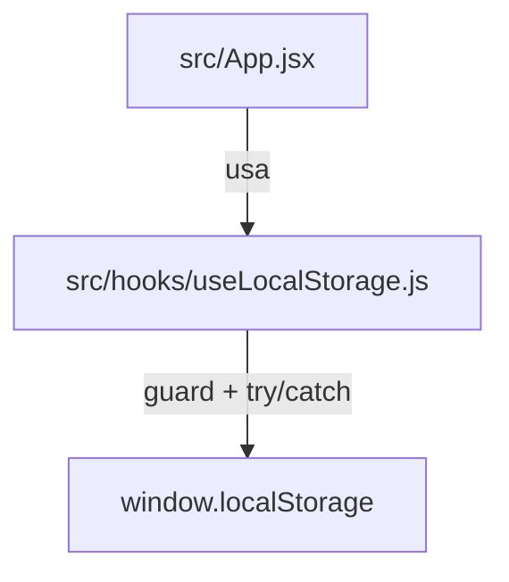

# Implementation Plan - Extrair hook customizado useLocalStorage (Issue #6)

> **For agentic workers:** REQUIRED SUB-SKILL: Use superpowers:subagent-driven-development to implement this plan task-by-task. Steps use checkbox (`- [ ]`) syntax for tracking.

**Goal:** Centralizar o acesso e proteções ao `window.localStorage` extraindo um hook customizado `useLocalStorage` e refatorando o `App.jsx` para utilizá-lo.

**Architecture:** O hook `useLocalStorage` encapsulará a verificação de `window.localStorage`, parsing/stringifying JSON, e gestão de exceções no storage. O componente `App.jsx` consumirá este hook em substituição ao código verboso e repetitivo de leitoras/escritoras inline.

**Architecture Diagram:**



**Tech Stack:** React 18, Vitest / React Testing Library.

## Global Constraints

- Manter cobertura de testes alta com nova suíte `src/hooks/useLocalStorage.test.js`.
- Manter o contrato de execução sem breaking changes em `src/App.jsx`.

---

### Task 1: Criar o hook `useLocalStorage` com suíte de testes isolada

**Files:**
- Create: `src/hooks/useLocalStorage.js`
- Create: `src/hooks/useLocalStorage.test.js`

**Interfaces:**
- Consumes: `React.useState`, `React.useEffect`, `React.useCallback`
- Produces: `useLocalStorage(key, initialValue) => [storedValue, setValue]`

- [ ] **Step 1: Escrever os testes que falham para o `useLocalStorage`**

Create `src/hooks/useLocalStorage.test.js`:
```javascript
import { renderHook, act } from '@testing-library/react'
import { describe, it, expect, beforeEach, vi } from 'vitest'
import useLocalStorage from './useLocalStorage'

describe('useLocalStorage', () => {
  beforeEach(() => {
    window.localStorage.clear()
    vi.restoreAllMocks()
  })

  it('retorna initialValue quando localStorage está vazio', () => {
    const { result } = renderHook(() => useLocalStorage('test_key', 'default_val'))
    expect(result.current[0]).toBe('default_val')
  })

  it('lê valor existente no localStorage', () => {
    window.localStorage.setItem('test_key', JSON.stringify('saved_val'))
    const { result } = renderHook(() => useLocalStorage('test_key', 'default_val'))
    expect(result.current[0]).toBe('saved_val')
  })

  it('atualiza valor no state e no localStorage', () => {
    const { result } = renderHook(() => useLocalStorage('test_key', 'initial'))
    act(() => {
      result.current[1]('updated')
    })
    expect(result.current[0]).toBe('updated')
    expect(window.localStorage.getItem('test_key')).toBe(JSON.stringify('updated'))
  })

  it('suporta updater function em setValue', () => {
    const { result } = renderHook(() => useLocalStorage('count', 1))
    act(() => {
      result.current[1]((prev) => prev + 1)
    })
    expect(result.current[0]).toBe(2)
  })

  it('trata graciosamente erro de JSON parse', () => {
    window.localStorage.setItem('invalid_json', '{broken-json')
    const { result } = renderHook(() => useLocalStorage('invalid_json', 'fallback'))
    expect(result.current[0]).toBe('fallback')
  })
})
```

- [ ] **Step 2: Executar o teste e verificar que falha**

Run: `npx vitest run src/hooks/useLocalStorage.test.js`
Expected: FAIL (module `useLocalStorage` not found)

- [ ] **Step 3: Escrever a implementação do `useLocalStorage.js`**

Create `src/hooks/useLocalStorage.js`:
```javascript
import { useState, useCallback } from 'react'

export default function useLocalStorage(key, initialValue) {
  const [storedValue, setStoredValue] = useState(() => {
    if (typeof window === 'undefined' || !window.localStorage) {
      return typeof initialValue === 'function' ? initialValue() : initialValue
    }
    try {
      const item = window.localStorage.getItem(key)
      return item !== null ? JSON.parse(item) : (typeof initialValue === 'function' ? initialValue() : initialValue)
    } catch (error) {
      console.warn(`Erro ao ler localStorage key "${key}":`, error)
      return typeof initialValue === 'function' ? initialValue() : initialValue
    }
  })

  const setValue = useCallback((value) => {
    try {
      setStoredValue((prev) => {
        const valueToStore = typeof value === 'function' ? value(prev) : value
        if (typeof window !== 'undefined' && window.localStorage) {
          if (valueToStore === undefined || valueToStore === null) {
            window.localStorage.removeItem(key)
          } else {
            window.localStorage.setItem(key, JSON.stringify(valueToStore))
          }
        }
        return valueToStore
      })
    } catch (error) {
      console.warn(`Erro ao escrever no localStorage key "${key}":`, error)
    }
  }, [key])

  return [storedValue, setValue]
}
```

- [ ] **Step 4: Executar o teste isolado para verificar passagem**

Run: `npx vitest run src/hooks/useLocalStorage.test.js`
Expected: PASS

- [ ] **Step 5: Commit**

```bash
git add src/hooks/useLocalStorage.js src/hooks/useLocalStorage.test.js
git commit -m "feat(hooks): add useLocalStorage hook with unit tests (Ref #6)"
```

---

### Task 2: Refatorar `App.jsx` para utilizar `useLocalStorage` e atualizar testes

**Files:**
- Modify: `src/App.jsx`
- Modify: `src/App.test.jsx`

- [ ] **Step 1: Sublocar estados do `App.jsx` para `useLocalStorage`**

Importar `useLocalStorage` em `src/App.jsx` e substituir inicializações e escritas repetitivas de `window.localStorage` para os estados `provider`, `titlePref`, `username` e `recentUsers`.

- [ ] **Step 2: Rodar todos os testes para garantir integridade da aplicação**

Run: `npm run test` e `npm run lint`
Expected: PASS

- [ ] **Step 3: Commit final**

```bash
git add src/App.jsx src/App.test.jsx
git commit -m "refactor(app): migrate state persistence to useLocalStorage (Fixes #6)"
```
