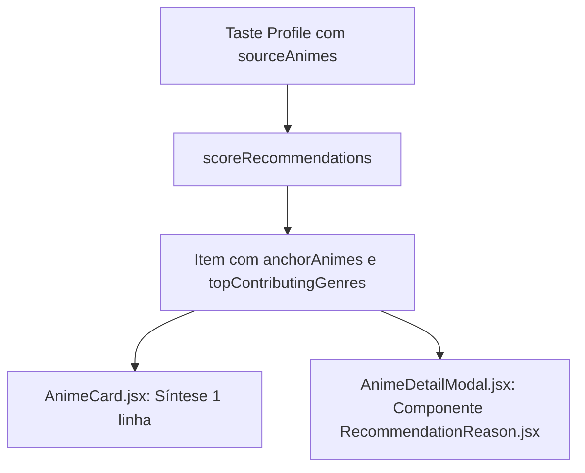

# B1: Explicação da Recomendação ("Por que esse anime?") Implementation Plan

> **For agentic workers:** REQUIRED SUB-SKILL: Use superpowers:subagent-driven-development to implement this plan task-by-task. Steps use checkbox (`- [ ]`) syntax for tracking.

**Goal:** Fornecer explicação multinível e âncoras personalizadas de recomendação ("Por que esse anime?") no Card e no Modal de detalhes.

**Architecture:** O `recommender.js` passa a computar `anchorAnimes` (top animes assistidos/avaliados nos gêneros do item) e `topContributingGenres`. O `AnimeCard.jsx` exibe uma linha de síntese e o `AnimeDetailModal.jsx` renderiza `RecommendationReason.jsx` com a decomposição e referências.

**Architecture Diagram:**

**Tech Stack:** React 19, i18next, Vitest + Testing Library, CSS Modules.

## Global Constraints
- Node / Vite / Vitest
- i18n suportando `pt-BR`, `en`, `ja`
- Seguir convenção TDD e linters oxlint

---

### Task 1: Enriquecer `scoreRecommendations` em `recommender.js` com `anchorAnimes` e `topContributingGenres`

**Files:**
- Modify: `src/logic/recommender.js`
- Test: `src/logic/recommender.test.js`

**Interfaces:**
- Produces: `anime.anchorAnimes` (`[{ id, title, score, coverImage }]`), `anime.topContributingGenres` (`[{ genre, score }]`)

- [ ] **Step 1: Write the failing test in `src/logic/recommender.test.js`**
- [ ] **Step 2: Run test to verify it fails (`npm run test -- src/logic/recommender.test.js`)**
- [ ] **Step 3: Implement `anchorAnimes` e `topContributingGenres` extraction em `src/logic/recommender.js`**
- [ ] **Step 4: Run test to verify it passes**
- [ ] **Step 5: Commit (`git commit -m "feat(recommender): extract anchor animes and top genres for explanations"`)**

---

### Task 2: Criar chaves de tradução i18n (`pt-BR`, `en`, `ja`)

**Files:**
- Modify: `src/locales/pt-BR.json`
- Modify: `src/locales/en.json`
- Modify: `src/locales/ja.json`

- [ ] **Step 1: Adicionar chaves de síntese e explicação**
- [ ] **Step 2: Verificar sintaxe JSON válida**
- [ ] **Step 3: Commit (`git commit -m "feat(i18n): add translations for recommendation reasoning"`)**

---

### Task 3: Criar componente `RecommendationReason.jsx` e estilos

**Files:**
- Create: `src/components/RecommendationReason.jsx`
- Create: `src/components/RecommendationReason.module.css`
- Create: `src/components/RecommendationReason.test.jsx`

- [ ] **Step 1: Escrever teste falhando para `RecommendationReason.test.jsx`**
- [ ] **Step 2: Executar teste e verificar falha**
- [ ] **Step 3: Implementar componente `RecommendationReason.jsx` com CSS Module**
- [ ] **Step 4: Executar teste e verificar aprovação**
- [ ] **Step 5: Commit (`git commit -m "feat(ui): add RecommendationReason component"`)**

---

### Task 4: Integrar no `AnimeCard.jsx` e `AnimeDetailModal.jsx`

**Files:**
- Modify: `src/components/AnimeCard.jsx`
- Modify: `src/components/AnimeCard.module.css`
- Modify: `src/components/AnimeDetailModal.jsx`
- Test: `src/components/AnimeCard.test.jsx`
- Test: `src/components/AnimeDetailModal.test.jsx` (ou criar se não existir)

- [ ] **Step 1: Atualizar testes de AnimeCard e Modal com nova UI**
- [ ] **Step 2: Integrar síntese no AnimeCard e `RecommendationReason` no Modal**
- [ ] **Step 3: Rodar todos os testes (`npm run test`)**
- [ ] **Step 4: Commit (`git commit -m "feat(ui): integrate recommendation reason in card and modal"`)**
